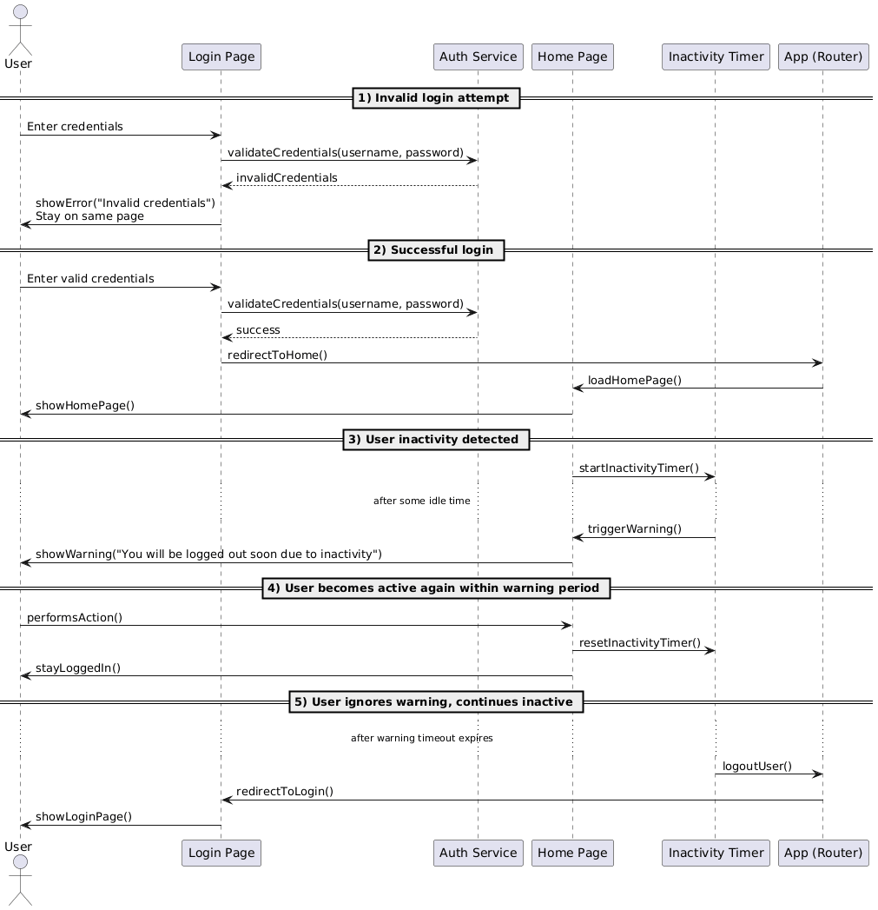

[## Auto Logout (Inactivity Timeout)

This document explains the application's auto-logout feature triggered by user inactivity.

### Overview

- The app monitors user activity and automatically logs out after a configurable idle period, with an optional grace period before enforcement.
- The feature is initialized at the app root and is independent of individual screens.

### Key Components

- `InactivityTracker` (root wrapper): Observes user interactions and timers, and invokes a callback on timeout.
- `AuthProvider`: Provides `isLoggedIn` state and handles logout navigation/state reset.
- `main.dart` bootstrapping:
  - Reads timeout (`_idleDuration`) and `gracePeriod` (`_graceDuration`) from server or local config.
  - Wraps the app with `InactivityTracker` and passes `isUserLoggedIn` and `onTimeout`.

### Configuration

- Source: server-driven or local config (see where `_idleDuration` and `_graceDuration` are loaded in `main.dart`).
- Typical values:
  - Idle timeout: e.g., 15 minutes
  - Grace period: e.g., 30 seconds (optional). During grace period, a warning UI can be shown (implementation-specific).

### Lifecycle & Flow

1. App starts → `InactivityTracker` is mounted around the entire app.
2. Every user input (tap, scroll, key, etc.) resets the idle timer when `isUserLoggedIn == true`.
3. If no input occurs for `timeout`, the tracker enters grace (if configured) and then triggers `onTimeout`.
4. `onTimeout` performs logout (usually via `AuthProvider`) and navigates to the login screen.

### Public API (InactivityTracker)

Constructor (as used in the app):

dart
InactivityTracker(
  timeout: _idleDuration,
  gracePeriod: _graceDuration,
  isUserLoggedIn: authProvider.isLoggedIn,
  onTimeout: _handleAutoLogout,
  child: child!,
)

Props:
- `timeout` (Duration): Idle time before auto-logout.
- `gracePeriod` (Duration): Optional buffer after timeout.
- `isUserLoggedIn` (bool): Enables/disables tracking.
- `onTimeout` (void Function()): Callback to execute logout.

### Logout Handling

- `onTimeout` should:
  - Clear sensitive state
  - Revoke tokens/session
  - Navigate to the login route
  - Optionally show a toast/banner indicating session expired due to inactivity

### Testing Guide

1. Set very small values in config (e.g., timeout 10s, grace 5s).
2. Launch app, log in, then stay idle → expect logout after ~15s.
3. Interact before timeout → verify the timer resets and no logout occurs.
4. Toggle `isUserLoggedIn` to false (e.g., from login page) → tracker should be effectively disabled.
5. Background/foreground the app per policy and verify expected behavior.

### Observability

- Add logs around:
  - Timer start/reset
  - Entering grace period
  - Timeout fired
  - Logout result/navigation

### Security Notes

- Ensure all sensitive screens require an authenticated session.
- On timeout, clear all cached secrets and revoke sessions.
- Consider masking or blanking UI during grace period if policy requires.

### Extensibility

- Hook into biometric re-auth during grace period instead of full logout.
- Persist last-activity timestamp to storage to enforce timeout across restarts.

### Related Code Pointers

- `lib/main.dart`: Initializes `InactivityTracker` with timeouts and `onTimeout`.
- `AuthProvider`: Holds login state and handles logout.

## Sequence Diagram
The following sequence diagram illustrates the registration process, including the use of the Auto logout Feature:

