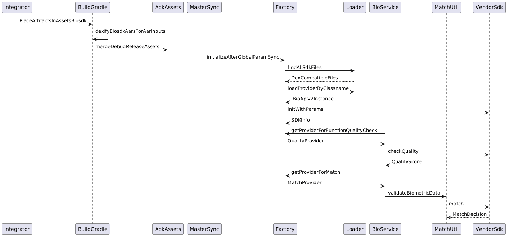

# Design - BioSDK Packaging and Dynamic Loading in ARC

## Purpose

This document explains how to include biometric SDK artifacts (`.aar`, `.jar`, `.zip`) in Android Registration Client (ARC) at build time so the final APK can dynamically load the configured SDK provider for:
- biometric quality check (`IBioApiV2.checkQuality`)
- local deduplication match (`IBioApiV2.match`)

## Scope

This covers:
- build-time packaging in `clientmanager`
- runtime SDK discovery/loading
- provider configuration keys
- cached instances/configuration
- quality and match runtime flow

This does not define vendor SDK internals.

## Build-Time Packaging of SDK Artifacts

### 1) Place vendor artifacts

Put vendor SDK artifacts under:

`android/clientmanager/src/main/assets/biosdk/`

Supported runtime container formats are validated as:
- direct DEX file (`.dex`)
- ZIP containers containing `classes.dex` (`.jar`, `.apk`, `.zip`)

### 2) AAR conversion during build

`android/clientmanager/build.gradle` defines `dexifyBiosdkAars`:
- scans `src/main/assets/biosdk` for `.aar`
- extracts `classes.jar`
- runs D8 (`com.android.tools.r8.D8`)
- creates a DEX JAR output at `build/biosdk-dex/biosdk/<name>.jar` containing `classes.dex`

If a prebuilt `<name>.jar` already exists in `assets/biosdk`, AAR conversion for that base name is skipped.

### 3) Merge into final APK assets

`sourceSets.main.assets.srcDirs` prepends:
- generated DEX assets: `${buildDir}/biosdk-dex/biosdk`
- static assets: `src/main/assets`

`mergeDebugAssets` and `mergeReleaseAssets` depend on `dexifyBiosdkAars`, so conversion runs before asset packaging.

Result: final APK includes runtime-loadable SDK containers in assets.

## Runtime Dynamic Loading

### Initialization trigger

After global parameters sync, `MasterDataSyncApi.getGlobalParamsSync(...)` calls:
- `bioSdkProviderFactory.initialize()`

Also, provider lookup lazily initializes when needed if registry is empty.

### Loader behavior (`BioSdkLoader`)

1. `findAllSdkFiles(context)` discovers SDK files from assets (`biosdk/` first, then assets root).
2. Each valid asset is copied to `filesDir/biosdk`.
3. Validation ensures each file is DEX-compatible (DEX magic or ZIP with `classes.dex`).
4. `loadProvider(context, className, sdkFiles)` iterates files, creates `DexClassLoader`, loads configured class, and accepts only classes implementing `IBioApiV2`.

## Provider Configuration (How SDK Is Identified)

Provider keys are read from global params by `GlobalParamRepository` using prefix:

`mosip.biometric.sdk.providers`

Pattern:

`mosip.biometric.sdk.providers.<modality>.<vendorId>.<parameter>=<value>`

Example:

```properties
mosip.biometric.sdk.providers.finger.mockvendor.classname=io.mosip.mock.sdk.impl.SampleSDK
mosip.biometric.sdk.providers.finger.mockvendor.version=0.9
mosip.biometric.sdk.providers.finger.mockvendor.threshold=60
mosip.biometric.sdk.providers.iris.mockvendor.classname=io.mosip.mock.sdk.impl.SampleSDK
mosip.biometric.sdk.providers.face.mockvendor.classname=io.mosip.mock.sdk.impl.SampleSDK
```

Factory expectations:
- required: `classname`
- optional: `version` (checked against `SDKInfo.getApiVersion()`)
- all parameters are passed to `provider.init(params)`

Supported modality keys in factory mapping:
- `finger`
- `iris`
- `face`

## What Is Cached

### 1) Parsed provider config cache

`GlobalParamRepository.bioSdkProviderConfigCache`
- shape: `modality -> vendorId -> paramKey/value`
- built lazily by `getBiometricProviderConfig()`
- cleared on `refreshConfigurationCache()`

### 2) Loaded provider registry cache

`BioSdkProviderFactory.registry`
- shape: modality key -> list of `ProviderEntry`
- each `ProviderEntry` contains:
  - loaded `IBioApiV2` instance
  - corresponding `SDKInfo` returned by `provider.init(...)`

Provider selection:
- `getProviderForFunction(modality, function)` checks `SDKInfo.getSupportedMethods()`
- `getProviderForMatch(modality)` delegates with `BiometricFunction.MATCH`

## Runtime Use for Quality and Match

### Quality score path

In `Biometrics095Service.handleRCaptureResponse(...)`:
1. If `mosip.registration.quality_check_with_sdk` is enabled:
2. `getSDKScore(...)` builds `BIR` from captured ISO
3. fetches provider via `getProviderForFunction(modality, QUALITY_CHECK)`
4. calls `checkQuality(sample, modalitiesToCheck, flags)`
5. extracts score from `QualityCheck.getScores()`
6. stores value into `BiometricsDto.sdkScore`

If provider is unavailable or call fails, SDK score defaults to `0`.

### Match (dedupe) path

Also in `handleRCaptureResponse(...)`:
1. If `mosip.registration.mds.deduplication.enable.flag` in shared preferences is `Y`/enabled:
2. obtains provider via `getProviderForMatch(modality)`
3. calls:
   - `MatchUtil.validateBiometricData(...)` for operator onboarding (excludes current user), or
   - `MatchUtil.validateBiometricDataForRegistration(...)` for registration (all operators)
4. `MatchUtil` builds probe/gallery `BiometricRecord` values and calls:
   - `IBioApiV2.match(probe, gallery, biometricTypes, flags)`
5. on `MATCHED`, flow throws dedupe exception and blocks capture progression

If dedupe is enabled but no match provider is available, SDK unavailable exception is raised.

## Integrator Checklist

1. Add SDK binaries into `android/clientmanager/src/main/assets/biosdk/`.
2. For `.aar`, ensure conversion is successful during build (`dexifyBiosdkAars` logs).
3. Configure provider keys under `mosip.biometric.sdk.providers.<modality>.<vendorId>.*`.
4. Set `classname` to the loadable provider class implementing `IBioApiV2`.
5. Sync global params and verify `BioSdkProviderFactory.initialize()` runs.
6. Validate:
   - quality path with `mosip.registration.quality_check_with_sdk`
   - dedupe match path with `mosip.registration.mds.deduplication.enable.flag`

## Rebuild vs Config-Only Change

Config-only (no APK rebuild):
- switching `classname`, `version`, thresholds/args in global params

APK rebuild required:
- adding/replacing SDK binary artifacts (`.aar/.jar/.zip/.dex`) in assets

## Sequence Diagram



