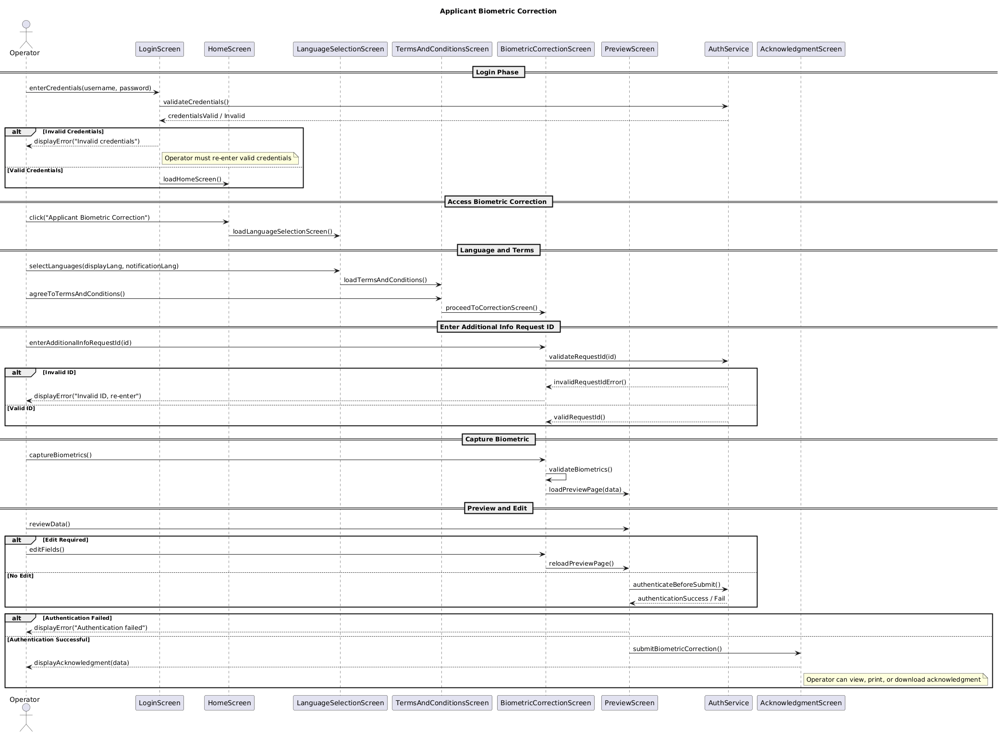

## Biometric Correction

This document describes the Biometric Correction feature — its purpose, workflow, data handling, validations, and integration points.

### Problem Statement (Story)

As an Operator,
I should be able to correct the Applicant’s biometric data
so that the Applicant has the correct biometrics associated with their UIN.

The feature must work in both online and offline modes.

If a resident’s biometrics cannot be captured during initial registration, they do not receive an Application ID.
Instead, they receive an Additional Info Request ID (AIR-ID) via the configured communication channel (email/SMS), along with:

  - Appointment date
  - Appointment time
  - Registration center details

### Purpose

To allow operators to capture or correct an applicant’s biometric data (face, fingerprints, iris) when:

   - Quality thresholds are not met during registration, or
   - A re-capture is required by policy or audit.

### Scope

- Supported modalities (typical): Face, Fingerprints (single/flat/rolled), Iris (left/right)
- Operations:
  - View current biometrics and quality scores
  - Re-capture one or more modalities
  - Replace existing samples after passing quality checks
  - Persist corrected samples and attach to the enrollment/record

### High‑Level Flow

  1. Launch the Registration Client → navigate to Applicant Biometric Correction.
  2. Load existing biometric metadata and quality information.
  3. Select a modality for correction.
  4. Initiate capture through the platform SPI/SDK.
  5. Run quality and liveness checks on captured samples.
  6. If checks pass → confirm replacement and update the record (with audit entry).
  If checks fail → allow retry (within configured attempt limits).

### End-to-End User Journey (Screens)

1) Login
- Operator logs into the Android Registration Client with valid credentials. 
- Invalid credentials → show error and deny access.

2) Home → Applicant Biometric Correction
- Entry point from home/dashboard.

3) Language Selection
- Select display language and notification language; both required.

4) Terms & Conditions
- Must explicitly accept to proceed.

5) AIR-ID Entry
- Input Additional Info Request Id (AIR-ID). Mandatory; validate format and existence.
- On offline mode, validation is against cached/prefetched AIR entries; otherwise against backend.

6) Capture
- Show modalities pending correction; start capture via device SPI for each selected modality.
- Persist temporary session data until confirmation.

7) Preview
- Display all captured/entered data; allow editing (navigate back to specific steps) and return to preview.

8) Operator Re‑Authentication
- Prompt for credentials (or step‑up auth) before submission.

9) Acknowledgment
- Show submission summary; provide optional download/print.

### Capture & Validation

- Capture uses the platform SPI/SDK in the following sequence:
  1. Check device connectivity and permissions.s
  2. Trigger capture with the chosen modality and quality profile.
  3. Receive raw/template data and capture metadata.
  4. Perform validations:
     - Minimum quality score (per modality)
     - Liveness detection (if enabled)
     - Template decode/format validation 
     - Image characteristics (e.g., pose, illumination, focus, NFIQ for fingerprints)
  5. On validation success → proceed to preview.
      - On failure → show specific error and allow retry (up to max attempts).

### Quality Thresholds

  - Configured centrally per modality:
  - `minQuality.face`, `minQuality.fp`, `minQuality.iris`
  - Can specify stricter thresholds for correction sessions.
  - Maximum retry count configurable per modality.

### Persistence

- Online Mode
  - Upon successful validation and authentication:
  - Store the corrected samples (encrypted)
  - Mark superseded samples as archived/audited 
  - Update the applicant’s biometric map and quality metadata 
  - Emit a CorrectionEvent for audit and synchronization
  - 
- Offline mode:
    - Store the correction locally in an encrypted queue with AIR-ID as the key. 
    - Include:
         - Capture timestamp 
         - Center ID 
    - Mark record as pending_sync. 
    - When connectivity is restored:
         - Sync queued corrections to backend 
         - Mark as submitted upon confirmation.
         - 
### Security & Privacy

- Encrypt biometric data both in transit (TLS) and at rest. 
- Restrict access to authorized operator roles only. 
- Apply UI masking or overlays for raw biometrics when policy requires. 
- Scrub all PII from logs; retain only reference IDs or hashes.

### Error Handling

- Device errors: connection, permissions, firmware mismatch → show remediation steps
- Validation failures: quality/liveness below threshold → guidance to improve capture
- Storage/network failures: retry with exponential backoff; never lose audit trail

### Configuration

- Thresholds per modality, liveness toggle, max retries
- Preview masking policy and thumbnail sizes
- Audit retention policy for superseded samples

#### Property Keys

The following configuration keys are consumed by the Biometric Correction feature. Namespacing is suggested as shown; align with your existing config loader. Example values are illustrative.

Notes:
- If your project centralizes API base URLs and auth, only the path keys are needed here.
- Regex for `airId` should match server‑side rules; keep in sync.
- Thresholds and liveness requirements can be tuned per deployment.

## Acceptance Criteria Mapping

- Login required → feature entry hidden until authenticated
- Home shows "Applicant Biometric Correction" → navigates to language selection
- Language & notification selections mandatory → validation at step boundary
- T&C acceptance mandatory → cannot proceed otherwise
- AIR-ID mandatory → validate format and existence; show error on invalid
- Capture required modalities → enforce quality/liveness configured thresholds
- Preview allows review and back‑edit → maintains session data
- Re‑auth required before submission → failure blocks submission
- Acknowledgment shows all details; success feedback; optional print/download
- Works offline → queue submission; sync later

## Future Scope
   - Applicant Demographic Correction 
   - Applicant Document Correction

## Sequence Diagram
The following sequence diagram illustrates the registration process, including the use of the Biometric correction Feature:

