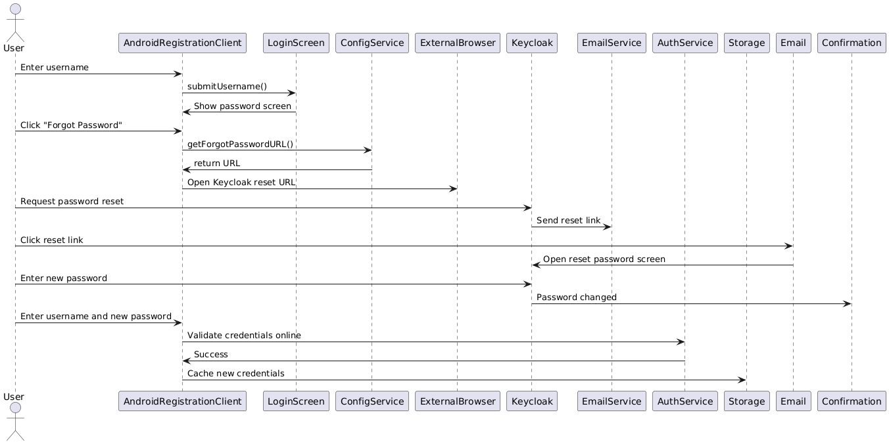

# Design – Forgot Password Flow

## Background
When the user is on the Android Registration Client (ARC) login screen and forgets their password, they should have an option to reset it using the Keycloak portal. Upon triggering the “Forgot Password” option, the user is redirected to Keycloak, where they receive a reset email, create a new password, and can then log in to ARC again

## Target Users
* Operator
* Registration Supervisor

## Key Requirements
1. Android Registration Client (ARC) must be installed.
2. Login credentials (username) must exist in the system.
3. Device should be in online mode to complete the password reset.
4. The "Forgot Password" redirect URL should be configurable.
5. User clicks "Forgot Password" from the password entry screen.
6. ARC redirects the user to Keycloak "Forgot Password" screen.
7. Keycloak sends a reset link to the registered email address.
8. User clicks the email link and creates a new password.
9. User returns to ARC login and logs in with the new password.

## Non-Functional Requirements
1. No plain-text passwords must be stored or cached.
2. Passwords must be verified against Keycloak securely.
3. Password reset should be allowed only in online mode.

## Solution
1. Android Registration Client login screen must provide the `Forgot Password` link on the password page.
2. On click:
   * Retrieve the redirect URL from the configuration table.
   * Open the Keycloak reset password page using external browser.
3. Keycloak handles:
   * User email verification.
   * Sending reset email.
   * Password reset process.
4. Once reset is complete, the user returns to Android Registration Client and logs in.
5. Android Registration Client:
   * Authenticates the user online.
   * On success, stores the new hashed credentials for offline login.

## Sequence Diagram
