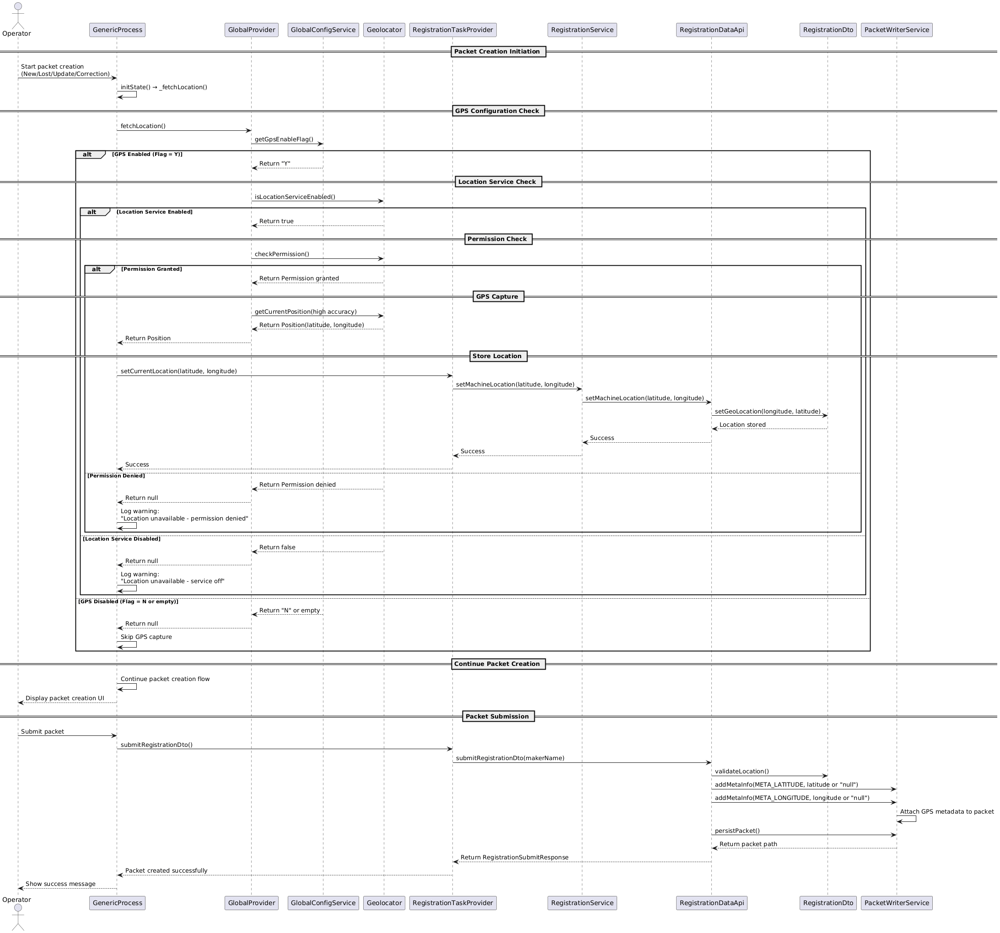

# GPS Location

## Background
Upon successful login to the Android Registration Client (ARC), when an Operator creates any packet (New Registration, Lost UIN, Update UIN, or Correction), the system must automatically capture the GPS location (latitude and longitude) and attach it as metadata to the packet. This feature ensures that the Operator's location is tracked at the point of packet creation, providing accurate geolocation data for audit and verification purposes. The GPS location capture works in both online and offline modes, storing coordinates locally when offline and syncing with the packet when connectivity is restored or during packet upload.

## Target Users
* Registration Operator

## Key Requirements
1. The Android Registration Client should be installed and running.
2. Operator must be logged in using valid and active credentials.
3. GPS location capture must be enabled via configuration flag `mosip.registration.gps_device_enable_flag`.
4. The system must capture GPS coordinates (latitude and longitude) automatically when packet creation is initiated.
5. Location capture must work in both online and offline modes.
6. GPS location must be attached to packet metadata at the point of packet creation.
7. The feature must handle scenarios where GPS is unavailable or location services are disabled.

## Configuration

### GPS Enable Flag Configuration

The GPS Location feature is controlled by the `mosip.registration.gps_device_enable_flag` configuration parameter in the `registration-default.properties` file:

```properties
mosip.registration.gps_device_enable_flag=Y
```

**Configuration Values:**
- `Y` - GPS location capture is enabled
- `N` - GPS location capture is disabled (default)

When the flag is set to `N` or is empty, GPS location capture will be skipped, and no GPS metadata will be added to packets.

### Location Permission Requirements

The Android Registration Client requires the following permissions:
- `ACCESS_FINE_LOCATION` - For high-accuracy GPS location
- `ACCESS_COARSE_LOCATION` - For network-based location (fallback)

These permissions must be granted at runtime when the app requests location access.

## Non-Functional Requirements
* GPS location capture must work in both online and offline modes.
* Location data must be securely stored within the packet metadata.
* Location metadata must be immutable once attached to the packet to maintain audit integrity.
* The feature must comply with local privacy regulations and consent requirements.
* Location capture must not block packet creation if GPS is unavailable.
* GPS metadata must be included in packet audit logs and be available for downstream processing.
* The feature must be tested across various Android devices and OS versions.
* Location must not be visible or editable by the Operator after submission.

## Solution
1. Configuration Check:
   * System checks `mosip.registration.gps_device_enable_flag` configuration value.
   * If flag is `N` or empty, GPS capture is skipped.
   * If flag is `Y`, GPS capture process is initiated.
2. Location Service Validation:
   * System checks if device location services are enabled.
   * If location services are disabled, system logs warning and proceeds without GPS data.
   * System checks and requests location permissions if not granted.
3. GPS Location Capture:
   * When packet creation is initiated (New Registration, Lost UIN, Update UIN, Applicant Correction), the system automatically fetches current GPS coordinates.
   * Location is captured using high-accuracy GPS mode via Geo-locator service.
   * Coordinates (latitude and longitude) are obtained along with timestamp.
4. Location Storage:
   * GPS coordinates are stored in RegistrationDto via setMachineLocation() method.
   * Location is stored in GeoLocationDto object with latitude and longitude.
5. Packet Metadata Attachment:
   * During packet submission, GPS coordinates are added to packet metadata.
   * Metadata includes: META_LATITUDE and META_LONGITUDE.
   * If GPS location is unavailable, metadata values are set to "null".
6. Offline Mode Support:
   * GPS coordinates are captured and stored locally even in offline mode.
   * Coordinates are attached to packet metadata when packet is created.
   * Packets with GPS metadata are stored locally and synced when connectivity is restored.
7. Error Handling:
   * If location services are disabled, system logs warning and continues without blocking packet creation.
   * If location permission is denied, system logs warning and continues without GPS data.
   * If GPS capture fails, metadata values are set to "null" and packet creation proceeds.
   * Packet is created with "No GPS data available" flag in metadata if location capture fails.

## Sequence Diagram


