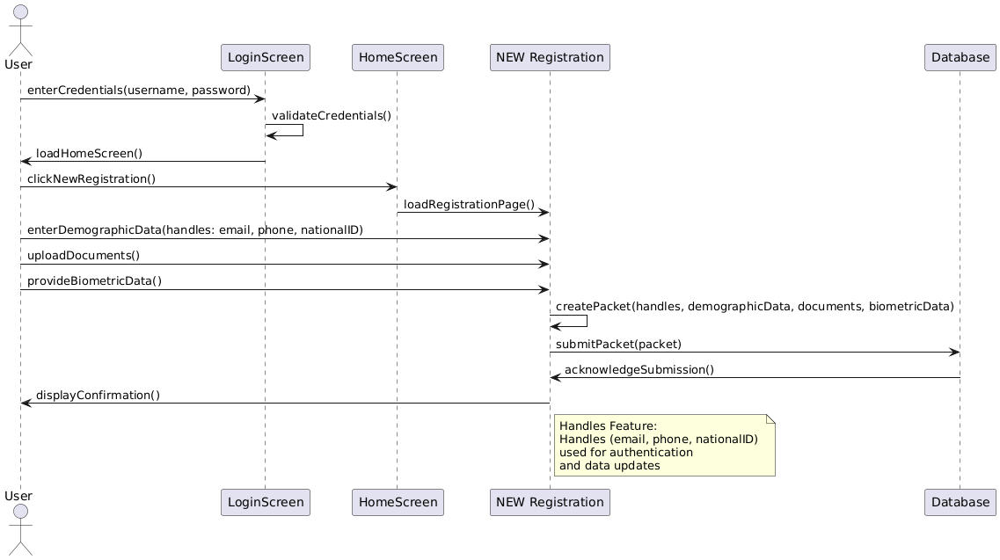

# Handles Feature 
The Handles Feature is designed to streamline citizen registration and authentication. During registration, specific attributes such as email, phone number, or national ID—can be designated as a handle. This handle serves as a unique identifier that can later be used for authentication for various services. Handles can also be used to update data in case of data discrepancies. By allowing flexible and secure identification, the feature enhances the accuracy and integrity of citizen records while simplifying user interactions with government systems.

# Configuration Guide

It is important to acknowledge that all properties listed in this guide are automatically synchronized with the Android Registration Client. These properties are sourced from the `registration-default.properties` file.

## Configuration Steps

### 1. Update the Handle Fields in `registration-default.properties`

In the `registration-default.properties` file, update the following property to specify the field values on which you want to enable the handle. Ensure that these field values match the field values in the IDSchema.

```properties
mosip.registration.default-selected-handle-fields=email,phone
```

### 2. Update the Regex for Handle Validation in `id-authentication-default.properties`
In the `id-authentication-default.properties` file, update the Regex to validate handles with the provided key as the postfix:

```properties
mosip.ida.handle-types.regex={ '@email' : '.*@email$', '@phonenumber' : '.*@phonenumber$' }
```

### 3. Map Postfix Values in `id-repository-default.properties`
In the `id-repository-default.properties` file, map the postfix values with the corresponding field values:

```properties
mosip.identity.fieldid.handle-postfix.mapping={'email':'@email', 'phone':'@phonenumber'}
```

#### Configuration files

* `application-default.properties`
* `registration-default.properties`

## Sequence Diagram
The following sequence diagram illustrates the registration process, including the use of the Handles Feature:


