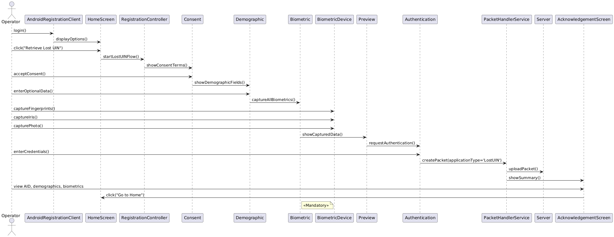

# Design – Retrieve Lost UIN  

## Background
Upon successful login to the Android Registration Client (ARC), the Operator should be able to assist a resident in retrieving their lost UIN by capturing their demographic and biometric data. This captured information is then securely uploaded to the server to process the request and generate a new Application ID (AID) for acknowledgment and future traceability.

## Target Users
* Operator
* Registration Supervisor
* Registration Officer

## Key Requirements
1. The Android Registration Client should be installed and running.
2. Operator must be logged in using valid and active credentials.
3. Resident must already have a UIN (processed registration).
4. Resident must be physically present for biometric capture.

## Non-Functional Requirements
* We should not store the RO/RS plain text credentials or any sensitive information

## Solution
1. Configuration:
   Load language options and other screen configurations from Global Configuration Parameter table.
2. Flow Controllers:
   * RegistrationController manages screen transitions and data flow.
   * ConsentController displays consent terms based on language.
   * DemographicController displays optional demographic fields.
   * BiometricController captures all biometrics (mandatory).
   * PreviewController shows captured data.
   * AuthController validates Operator credentials.
   * PacketHandlerService prepares and uploads the packet.
3. Packet Creation:
   * Use application type as 'LostUIN'.
   * Packet submitted to central server using configured sync service.
4. Data Persistence:
   * Final data stored in:
     * Registration table
     * RegistrationTransaction table

## Sequence Diagram
]