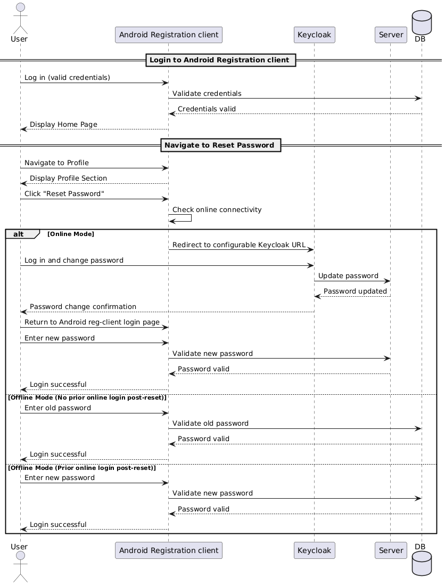

# Design – Reset Password

## Background
Upon successful login into the Android Registration Client (ARC), Operators and Supervisors should have the ability to reset their password. This is handled by redirecting them to a Keycloak portal, where they can change their password. Once reset, they can log back into Android Registration Client with the new password.

## Target Users
* Operator
* Registration Supervisor
   
## Key Requirements
1. ARC must be installed and accessible.
2. Operator/Supervisor credentials:
     * Must exist and be active in the system. 
     * Must be mapped to the same device, center, and zone. 
3. User must be logged into ARC in online mode. 
4. User navigates to the Profile section. 
5. `Reset Password` option must be visible in Profile. 
6. On click:
     * The user is redirected to a Keycloak login page (URL should be configurable).
     * After logging into Keycloak, the user can reset the password. 
7. The user logs out and logs back into ARC using the new password.

## Non-Functional Requirements
1. No plain-text passwords must be stored or cached. 
2. Passwords must be verified against Keycloak securely. 
3. Password reset should be allowed only in online mode.

## Solution
1. On clicking `Reset Password`, Android Registration Client should:
     * Retrieve the Keycloak reset URL from the global configuration table.
     * Redirect user using this URL. 
2. Keycloak handles the authentication and password change process. 
3. Once complete, the user returns to the ARC login screen. 
4. ARC handles the next login attempt using the new credentials. 
5. If the login is successful in online mode:
     * The new password is cached locally for offline login.
     * The old password becomes invalid. 
6. If no online login is performed after reset:
     * The old password will still be valid for offline use (until sync happens).

## Configuration step
1. Update the Keycloak URL in the `registration-default.properties` file:

   ```properties
   mosip.registration.reset_password_url=${keycloak.external.url}/auth/realms/mosip/account
   ```

## Sequence Diagram
