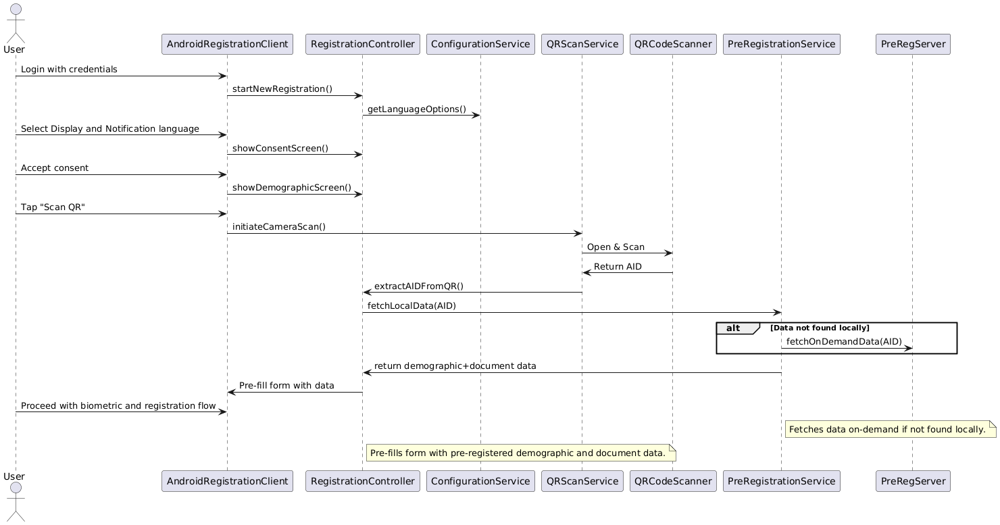

# Design – Scan PRID QR Code to Download Pre-Registration Data

## Background
Once the Operator logs into the Android Registration Client (ARC), they can initiate a new registration using a resident's pre-registration data. This data can be fetched by scanning the resident’s AID QR code, which was generated during pre-registration. The scanned data will auto-fill the demographic and document sections, streamlining the registration process

## Target Users
* Resident
* Registration Officer
* Registration Supervisor

## Key Requirements
1. The Android Registration Client must be installed and operational.
2. The Operator must be logged in using valid credentials.
3. The Resident should already be pre-registered and have a valid `AID` (Application ID).
4. The Operator navigates to the `New Registration` option from the home screen.
5. The Operator selects the desired Display and Notification languages:
     * `Display Language`: Used for on-screen data entry (Resident’s preference)
     * `Notification Language`: Used for sending SMS/email notifications
6. Consent screen must be shown in the selected display language.
7. On acceptance, the Operator lands on the Demographic Data Entry page.
8. Operator clicks on `Scan QR Code`:
     * The camera opens to scan the AID QR code. 
     * We use the `qr_code_scanner` Flutter plugin to enable QR code scanning functionality for reading the AID from the PRID QR code.
     * Once scanned, demographic and document data from pre-registration is fetched and auto-filled.
9. Operator proceeds with biometrics, document upload (if any), and completes the registration.

## Alternate Flows
* `Flow 1`: Operator skips QR scanning and proceeds to manually fill data.
* `Flow 2`: Operator enters AID manually (instead of scanning) to fetch data.

## Solution
1. `Language Selection`:
    * Display and Notification language options are pulled from configuration.
2. `Consent Page`:
    * Terms and conditions are rendered based on selected language.
3. `Demographic Page`:
    * `Scan QR` triggers the device camera and scans AID. 
    * The AID is validated and used to fetch pre-registered data via a service. 
    * On success, the data is auto-filled into the form.
4. `Fallback`:
    * If AID is not available locally, a network call fetches data on demand.
5. `Post-Processing`:
    * The AID is carried through the rest of the process and shown on preview and acknowledgement screens.

## Sequence Diagram

