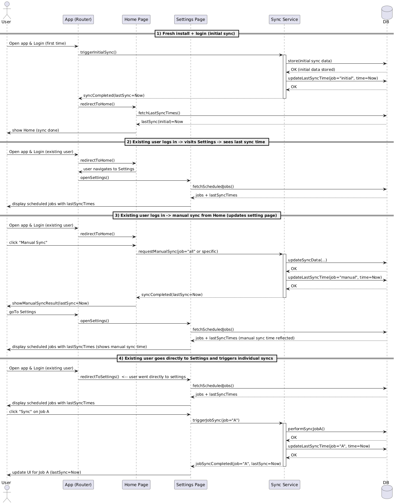
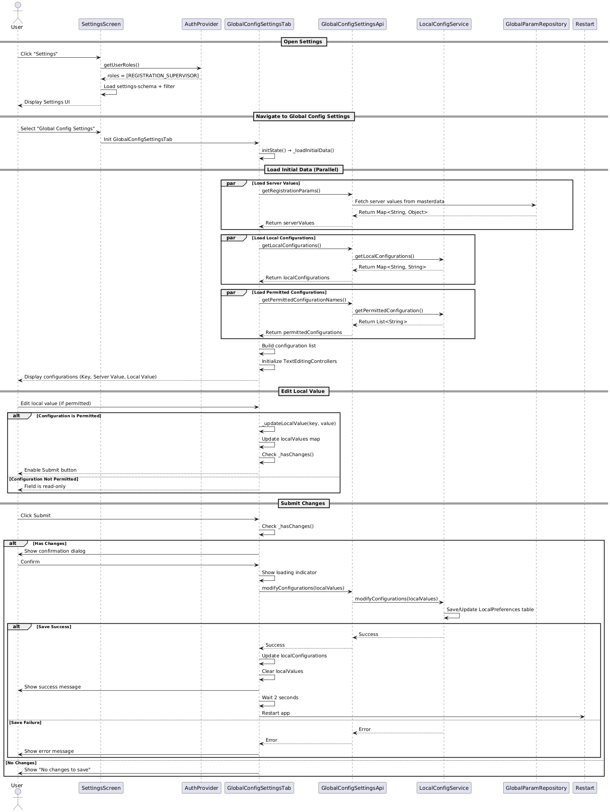
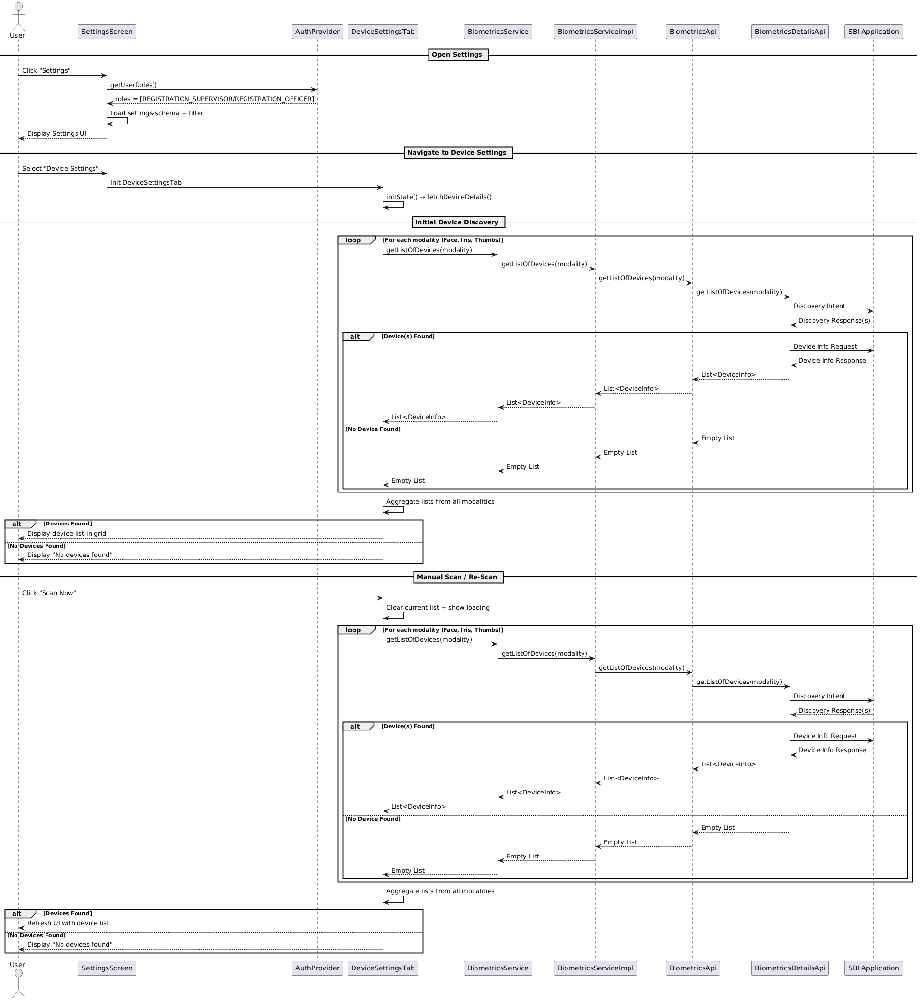

# Settings Module

The Settings module provides users with a centralized and easily accessible location to manage key application configurations. From the Home Page, users can quickly navigate to the Settings screen using a dedicated button placed at the bottom of the interface. This module is designed to streamline access to important controls such as Device Settings, Scheduled Job Settings, and Global Settings, ensuring that users can efficiently configure and maintain their application environment.

## Purpose
- Centralize application configuration and management.
- Make important controls discoverable and reachable from the Home Page.
- Provide consistent access to device, scheduled jobs, and global configuration panels.

## Navigation
- Access: Tap the dedicated Settings button located at the bottom of the Home Page to open the Settings screen.
- Flow: The Settings screen groups related controls and links to detail screens where applicable (e.g., Device Settings, Scheduled Job Settings, Global Settings).

## Key areas
- Device Settings: Configure hardware- or device-specific options (connectivity, biometric hardware, peripherals).
- Scheduled Job Settings: Manage periodic or background jobs, timings, and retention behaviors.
- Global Settings: App-wide configuration values that affect behavior across modules (e.g., feature toggles, thresholds, localization).

## Notes
- UI specifics (labels, placement, exact available options) depend on the UI specification and may vary between releases.
- Ensure permissions and role-based access are enforced for sensitive settings.

## Tab generation from schema

The Settings screen tabs are generated dynamically from a JSON schema. The schema drives which tabs appear, their order, labels in multiple languages, icons, the FXML view to load, and access control per role. This allows the Settings UI to be extended or reconfigured without code changes — only the schema needs updating.

Schema field mapping:
- name: internal identifier for the tab (used to route/load the correct content).
- label: localized labels (keys per locale) shown on the tab (e.g., label.eng, label.ara, label.fra).
- description: localized description for tooltips or accessibility.
- fxml: the FXML (or view) file that implements the tab content (e.g., ScheduledJobsSettings.fxml).
- icon / shortcut-icon: asset names for the tab/icon and optional shortcut tile.
- order: numeric sort order for tab placement (lower first).
- access-control: list of roles allowed to see/access the tab (UI hides tabs when the current user lacks required roles).

Behavior notes:
- Tabs are rendered in ascending order using the "order" field.
- Labels and descriptions are displayed using the user's current locale; fallback to English if missing.
- Tabs with an empty or missing access-control field are treated as public; otherwise visibility is role-based.
- If the referenced FXML/view is missing the app should show an error placeholder and log details for debugging.
- Icons are optional; missing icons fall back to a default tab icon.

Example schema (source of truth used by the Settings screen):
```json
[{
  "name":"scheduledjobs","description":{"ara":"إعدادات الوظائف المجدولة","fra":"Paramètres des travaux planifiés","eng":"Scheduled Jobs Settings"},"label":{"ara":"إعدادات الوظائف المجدولة","fra":"Paramètres des travaux planifiés","eng":"Scheduled Jobs Settings"},"fxml":"ScheduledJobsSettings.fxml","icon":"scheduledjobs.png","order":"1","shortcut-icon":"scheduledjobs-shortcut.png","access-control":["REGISTRATION_SUPERVISOR"]
  },
  {
    "name":"globalconfigs","description":{"ara":"إعدادات التكوين العامة","fra":"Paramètres de configuration globale","eng":"Global Config Settings"},"label":{"ara":"إعدادات التكوين العامة","fra":"Paramètres de configuration globale","eng":"Global Config Settings"},"fxml":"GlobalConfigSettings.fxml","icon":"globalconfigs.png","order":"2","shortcut-icon":"globalconfigs-shortcut.png","access-control":["REGISTRATION_SUPERVISOR","REGISTRATION_OFFICER"]
  },
  {
    "name":"devices","description":{"ara":"إعدادات الجهاز","fra":"Réglages de l'appareil","eng":"Device Settings"},"label":{"ara":"إعدادات الجهاز","fra":"Réglages de l'appareil","eng":"Device Settings"},"fxml":"DeviceSettings.fxml","icon":"devices.png","order":"3","shortcut-icon":"devices-shortcut.png","access-control":["REGISTRATION_SUPERVISOR","REGISTRATION_OFFICER"]
  }]
```

## Scheduled Jobs Settings

### Background
The Scheduled Jobs Settings screen allows authorized users to view, monitor, and manage scheduled syncs and batch jobs that run on the device. Administrators can inspect job metadata (name, cron expression, next/last run times), manually trigger a job, and — when permitted by role — override local cron expressions. All changes are device-local and do not affect server-side schedules.

### Target Users
* Registration Supervisor (editor)
* Registration Officer (view-only)

### Key Requirements
1. The Android Registration Client must be installed and running.
2. User must be logged in with valid credentials.
3. User must have the required role to access or edit scheduled jobs.
4. The Scheduled Jobs Settings option must be configured in the settings-schema.
5. The device must maintain a local scheduler or configuration store that defines available jobs.
6. Manual triggers must execute the corresponding local job logic immediately where permitted.

### Settings-Schema Configuration
The Scheduled Jobs Settings must be present in the `settings-schema`. Example entry:

```json
{
  "name": "scheduledjobs",
  "label": {
    "eng": "Scheduled Jobs Settings",
    "ar": "إعدادات الوظائف المجدولة",
    "fr": "Paramètres des travaux planifiés"
  },
  "description": {
    "eng": "View and manage scheduled syncs and batch jobs",
    "ar": "عرض وإدارة المهام الدورية والوظائف الدُفعيّة",
    "fr": "Afficher et gérer les tâches planifiées"
  },
  "fxml": "ScheduledJobsSettingsController",
  "access-control": ["REGISTRATION_SUPERVISOR"],
  "order": "1"
}
```

### Required Roles
* **REGISTRATION_SUPERVISOR** — can view, edit cron expressions, and submit changes (default editable role).
* **REGISTRATION_OFFICER** — view-only access (controls disabled).

Access control is enforced when building the Settings tabs and at render time for controls.

### Non-Functional Requirements
* Access control is driven by the settings-schema.
* Job list must be fetched from the device-local scheduler/config.
* Layout must be responsive across devices and orientations.
* Changes are stored locally and applied only to the current device.
* Cron expressions must be validated before saving.
* The Submit control is enabled only when local edits exist.
* Changing cron expressions requires an app restart or scheduler reload to take effect (documented).

### Solution
1. Configuration
   - Add entry in settings-schema as shown above.
   - Settings screen filters tabs based on the active user's roles.

2. Flow Controllers
   - SettingsScreen: builds visible tabs from schema and user roles.
   - ScheduledJobsSettingsTab / Controller: responsible for listing jobs, search, edit, validation, manual trigger, and local save.
   - SchedulerService: interface to local scheduler for reading job definitions, triggering jobs, and persisting local overrides.

3. Data Loading
   - Server values are fetched from masterdata via getActiveSyncJobs()
   - Load job definitions from the local scheduler or local configuration store.
   - Load last-run timestamps from local execution logs.
   - Compute next-run times from cron expressions (client-side computation or helper library).

4. UI
   - Present jobs in a scrollable list or grid. Each item shows:
     - Job Name
     - Next Run (calculated)
     - Last Run (from logs)
     - Cron Expression (readonly for view-only users; editable for supervisors)
     - Manual Trigger button/icon ("Run Now")
     - Submit button (per-item or global depending on UX choice)
   - Include a search box to filter jobs by key/name (partial match).
   - Disable editing and Submit for users without supervisor role.

5. Validation & Save
   - Validate cron syntax before allowing save; show inline error for invalid expressions.
   - Allow batch edits; when Submit is clicked validate all changes and persist valid set to local configuration store.
   - On successful save show confirmation toast/modal and reload local scheduler configuration.

6. Manual Trigger
   - Trigger job via SchedulerService.runJob(jobId).
   - Show immediate feedback (spinner/toast); update Last Run on success.
   - Respect device constraints (online state, battery) as per BRs.

7. Error Handling
   - Show meaningful errors for invalid cron, save failure, or trigger failure.
   - Prompt user to Save / Discard / Cancel when navigating away with unsaved changes.

### Basic Flow (user-facing)
1. User logs in to the Android Registration Client.
2. User taps Settings on Home Page.
3. User selects "Scheduled Job Settings".
4. Screen lists configured jobs with details and controls.
5. User can search, view details, manually trigger jobs, and (if permitted) edit cron and submit changes.

### Cron Expression Reference
- Minute (0 - 59)
- Hour (0 - 23)
- Day of month (1 - 31)
- Month (1 - 12)
- Day of week (0 - 7) (Sunday is 0 or 7)
Example: "0 0 11 * * ?" → At 11:00 AM every day

### Sequence Diagram


# Global Config Settings

## Background
Upon successful login to the Android Registration Client (ARC), authorized users (Supervisors) should be able to view and manage global configurations in a single Global Config Settings screen. This feature allows administrators to review, verify, and update system-wide settings. The feature displays server values fetched from masterdata and allows supervisors to override these values locally on the device. Local configuration changes apply only to the current device and do not affect server-side configurations or other devices. The system validates changes before saving.

## Target Users
* Registration Supervisor

## Key Requirements
1. The Android Registration Client should be installed and running.
2. User must be logged in using valid and active credentials.
3. User must have the required role (REGISTRATION_SUPERVISOR) to access and edit Global Config Settings.
4. Server values must be fetched from masterdata and displayed as read-only.
5. The Global Config Settings option must be configured in the settings-schema.
6. Only configurations listed in the permitted configuration keys list can be edited.
7. Local configuration changes apply only to the current device.

## Configuration

### Settings-Schema Configuration

The Global Config Settings feature must be configured in the `settings-schema` with the following JSON structure:

```json
{
  "name": "GlobalConfigSettings",
  "label": {
    "eng": "Global Configuration Settings",
    "ar": "إعدادات التكوين العامة",
    "fr": "Paramètres de configuration globaux",
    "hi": "ग्लोबल कॉन्फ़िगरेशन सेटिंग्स"
  },
  "description": {
    "eng": "View and manage global configurations",
    "ar": "عرض وإدارة التكوينات العامة",
    "fr": "Afficher et gérer les configurations globales",
    "hi": "ग्लोबल कॉन्फ़िगरेशन देखें और प्रबंधित करें"
  },
  "fxml": "GlobalConfigSettingsController",
  "access-control": [
    "REGISTRATION_SUPERVISOR"
  ],
  "order": "2"
}
```

### Required Roles

The Global Config Settings feature requires users to have the following role:

* **REGISTRATION_SUPERVISOR** - Registration Supervisor role

Only users with the REGISTRATION_SUPERVISOR role can:
- Access the Global Config Settings screen
- Edit local configuration values
- Submit and save configuration changes

Users without this role will not see the Global Config Settings option in the Settings screen. The access control is enforced at the Settings screen level, where only tabs matching the user's roles are displayed.

## Non-Functional Requirements
* Access control on this page is controlled via the settings-schema.
* Server values must be fetched from masterdata and displayed as read-only.
* Local values are device-specific and do not affect server configurations or other devices.
* The Submit button must only be enabled when there are changes to local values.
* The system must validate input format and value where applicable.
* The layout must be responsive and usable on all supported devices and screen sizes (portrait and landscape).
* Configuration changes require app restart to take effect.

## Solution
1. Configuration:
    * Global Config Settings option is configured in the settings-schema with controller name "GlobalConfigSettingsController".
    * Access control is defined in the settings-schema with role: REGISTRATION_SUPERVISOR.
    * Settings screen filters tabs based on user roles from the settings-schema.
    * Permitted configuration keys list determines which configurations can be edited.
2. Flow Controllers:
    * SettingsScreen displays available settings tabs based on user role.
    * GlobalConfigSettingsTab displays the list of global configurations with server and local values.
    * GlobalConfigSettingsApi handles fetching server values, local configurations, and permitted configuration names.
3. Data Loading:
    * Server values are fetched from masterdata via getRegistrationParams().
    * Local configurations are loaded from local storage via getLocalConfigurations().
    * Permitted configuration names are loaded to determine which configurations are editable.
    * All three data sources are loaded in parallel for optimal performance.
4. Configuration Display:
    * Each configuration displays: Key (name), Server Value (read-only), and Local Value (editable for permitted configs).
    * Modified configurations are visually indicated.
5. Editing Local Values:
    * Only configurations in the permitted configuration keys list can be edited.
    * Server values are always read-only.
    * Local values can be updated and are tracked in the localValues map.
    * Changes are validated before saving.
6. Submit Changes:
    * Submit button is enabled only when there are changes to local values.
    * On submit, confirmation dialog is shown with count of configurations to be updated.
    * Changes are saved to local storage via modifyConfigurations().
    * Success message is displayed and app is automatically restarted to apply changes.
7. Error Handling:
    * If save fails, error message is displayed to the user.
    * If no changes are detected, appropriate message is shown.

## Sequence Diagram


# Device Settings

## Background
Upon successful login to the Android Registration Client (ARC), authorized users (Supervisors and Officers) should be able to view and monitor all devices/peripherals connected to the tablet. This feature provides real-time device status information, enabling administrators to verify device connections, troubleshoot connectivity issues, and ensure proper device configuration for registration operations. The feature supports manual device scanning to detect newly connected devices and displays a comprehensive view of all connected biometric devices including scanners, printers, and other peripheral devices.

## Target Users
* Registration Supervisor
* Registration Officer

## Key Requirements
1. The Android Registration Client should be installed and running.
2. User must be logged in using valid and active credentials.
3. User must have the required role (REGISTRATION_SUPERVISOR or REGISTRATION_OFFICER) to access Device Settings.
4. Devices must be SBI-compliant and properly connected to the tablet.
5. The Device Settings option must be configured in the settings-schema.

## Configuration

### Settings-Schema Configuration

The Device Settings feature must be configured in the `settings-schema` with the following JSON structure:

```json
{
  "name": "DeviceSettings",
  "label": {
    "eng": "Device Settings",
    "ar": "إعدادات الجهاز",
    "fr": "Paramètres de l'appareil",
    "hi": "डिवाइस सेटिंग्स"
  },
  "description": {
    "eng": "View and manage connected devices",
    "ar": "عرض وإدارة الأجهزة المتصلة",
    "fr": "Afficher et gérer les appareils connectés",
    "hi": "कनेक्टेड उपकरण देखें और प्रबंधित करें"
  },
  "fxml": "DeviceSettingsController",
  "access-control": [
    "REGISTRATION_SUPERVISOR",
    "REGISTRATION_OFFICER"
  ],
  "order": "3"
}
```

### Required Roles

The Device Settings feature requires users to have one of the following roles:

* **REGISTRATION_SUPERVISOR** - Registration Supervisor role
* **REGISTRATION_OFFICER** - Registration Officer role

Users without these roles will not see the Device Settings option in the Settings screen. The access control is enforced at the Settings screen level, where only tabs matching the user's roles are displayed.

## Non-Functional Requirements
* Access control on this page is controlled via the settings-schema.
* The system must retrieve and display real-time status of connected devices/peripherals.
* The layout must be responsive and usable on all supported devices and screen sizes (portrait and landscape).

## Solution
1. Configuration:
    * Device Settings option is configured in the settings-schema with controller name "DeviceSettingsController".
    * Access control is defined in the settings-schema with roles: REGISTRATION_SUPERVISOR and REGISTRATION_OFFICER.
    * Settings screen filters tabs based on user roles from the settings-schema.
2. Flow Controllers:
    * SettingsScreen displays available settings tabs based on user role.
    * DeviceSettingsTab displays the list of connected devices.
    * BiometricsService handles device discovery across modalities (Face, Iris, Thumbs).
3. Device Discovery:
    * System scans for devices using Secure Biometric Interface (SBI) protocol.
    * Scans across three biometric modalities: Face, Iris, and Thumbs.
    * Uses Android Intent-based communication with SBI-compliant device applications.
    * Device information (Device Name, Device ID, Connection Status) is displayed in a grid layout.
4. Manual Refresh:
    * "Scan Now" button allows users to manually trigger device discovery.
    * Device list refreshes automatically based on scan results.
5. Error Handling:
    * If no devices are detected, displays "No devices found" message.
    * If scan fails, displays "Error loading device details" message.

## Sequence Diagram

