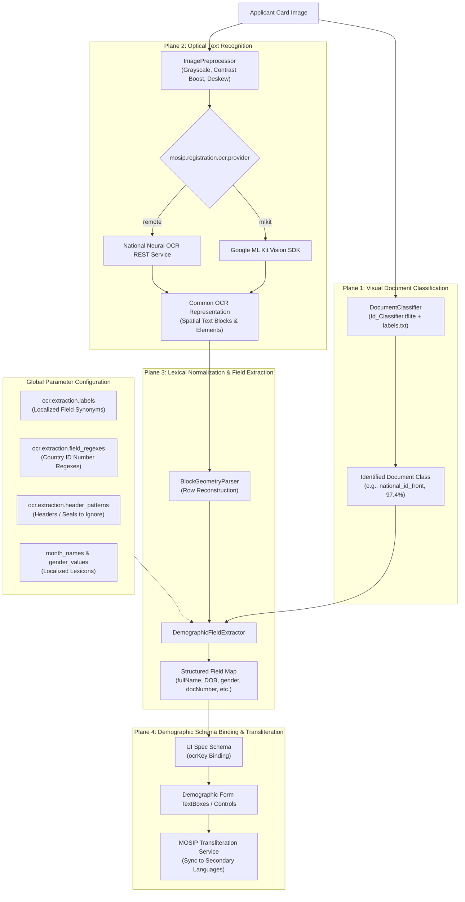

# MOSIP Android Registration Client (ARC) — Model Training & Country Adoption Blueprint

**Applies To**: MOSIP Android Registration Client (Release 1.2.0 and later)  
**Classification**: Technical Blueprint & Integration Specification  

---

## Table of Contents
1. [Executive Overview & Localization Architecture](#1-executive-overview--localization-architecture)
2. [Document Classification Customization (TFLite)](#2-document-classification-customization-tflite)
   - [2.1 Model Specifications & Edge Runtime](#21-model-specifications--edge-runtime)
   - [2.2 National Document Dataset Curation & Pre-Processing](#22-national-document-dataset-curation--pre-processing)
   - [2.3 Dataset Preparation & Directory Hierarchy](#23-dataset-preparation--directory-hierarchy)
   - [2.4 Complete End-to-End Training Pipeline (`train_classifier.py`)](#24-complete-end-to-end-training-pipeline-train_classifierpy)
   - [2.5 Quantization & Asset Deployment into Android ARC](#25-quantization--asset-deployment-into-android-arc)
3. [OCR Recognition Engine Selection & Script Adaptation](#3-ocr-recognition-engine-selection--script-adaptation)
   - [3.1 Google ML Kit Script Modules (On-Device)](#31-google-ml-kit-script-modules-on-device)
   - [3.2 Cloud OCR Engine Specification](#32-sovereign-remote--cloud-ocr-engine-specification)
4. [Linguistic & Field Extraction Configuration (No-Code Overrides)](#4-linguistic--field-extraction-configuration-no-code-overrides)
   - [4.1 Multilingual Label Synonyms (`extraction.labels`)](#41-multilingual-label-synonyms-extractionlabels)
   - [4.2 National Identification Regexes (`field_regexes`)](#42-national-identification-regexes-field_regexes)
   - [4.3 Localized Month Names & Gender Values](#43-localized-month-names--gender-values)
   - [4.4 Official Header Discard Patterns (`header_patterns`)](#44-official-header-discard-patterns-header_patterns)
5. [Demographic UI Schema Binding (`ocrKey`)](#5-demographic-ui-schema-binding-ocrkey)
6. [Pre-Rollout Quality Assurance & Benchmarking Checklist](#6-pre-rollout-quality-assurance--benchmarking-checklist)

---

## 1. Executive Overview & Localization Architecture

Every adopting country utilizes distinct physical identity documents (e.g., National ID cards, Passports, Driving Licenses, Voter Cards, Resident Permits) characterized by unique visual formats, national coats of arms, security guilloches, official languages, and numbering standards.

To accommodate country-specific identity documents without requiring core code changes, the MOSIP ARC OCR pipeline is decoupled across four independent localization planes:



---

## 2. Document Classification Customization (TFLite)

The document classifier identifies the physical document presented to apply context-specific extraction rules (for instance, suppressing address parsing on card types that do not print residential addresses).

### 2.1 Model Specifications & Edge Runtime
- **Model Backbone**: MobileNetV3-Large (Transfer learned from ImageNet).
- **Input Tensor**: `[1, 640, 640, 3]` (RGB color space), floating-point normalized to `[0.0, 1.0]`.
- **Output Tensor**: `[1, N]` where `N` is the number of classes defined in `labels.txt`.
- **Quantization**: Float16 or INT8 Post-Training Quantization (PTQ).
- **Target Latency**: <= 80 ms on standard Android ARM64 tablets.
- **Confidence Cutoff**: 0.60 (60%). Scores below 0.60 default to `UNKNOWN` fallback mode without throwing runtime errors.

---

### 2.2 National Document Dataset Curation & Pre-Processing

Because the national identity authority already maintains an official repository of identity documents (e.g., citizen issuance archives, high-resolution civil registry scans, physical specimen card series, and field enrollment pilot logs), synthetic card generation is not required.

Instead, the engineering focus is on **curation, class balancing, representation integrity, and sovereign data governance**:

#### 1. Ingestion Sources & Artifact Types
National identity authorities typically pull training assets from:
- **Specimen Card Repositories**: High-resolution specimen cards and printer calibration cards produced during national rollout tenders and design iterations.
- **Anonymized Civil Registry Scans**: Archival records representing various issuance years, regional printing centers, and material series.
- **Field Pilot Image Logs**: Real tablet camera captures collected during dry-runs and regional pilot registration centers under diverse lighting and tabletop backgrounds.

#### 2. Class Balancing & Representation Guidelines
To ensure the neural classifier generalizes across the full spectrum of physical cards encountered in registration centers:
- **Target Volume**: Maintain approximately 400 to 600 training images and 100 validation images per document class.
- **Card Series & Revisions**: If the national identity document has undergone revisions (e.g., legacy laminated cards vs. modern optical/smart chip cards), ensure all valid, circulating series are represented under the class or partitioned into distinct sub-classes.
- **Physical Wear & Degradation**: Include cards with realistic field wear (minor laminate scratches, faded signature lines, worn corners, and varied issuance years) alongside pristine specimen cards.
- **Front vs. Back Separation**: Always maintain separate classification labels for the front and reverse sides of cards (e.g., `national_id_front` and `national_id_back`), as their visual headers, layouts, and printed demographic attributes differ completely.

#### 3. Sovereign Environment & Security Governance
Because the dataset comprises real national identity documents containing citizen personal data:
- **Sovereign Training Cluster**: Execute all model training, image processing, and quantization inside secure, on-premise government infrastructure or a designated sovereign cloud environment.
- **Access Control & Auditing**: Enforce strict Role-Based Access Control (RBAC) on dataset storage volumes and log all model training runs to maintain chain-of-custody.
- **Zero Raw Data in Deployment**: Only the compiled, lightweight neural weights (`Id_Classifier.tflite` and `labels.txt`) are deployed to field enrollment tablets; no citizen images or raw training assets are bundled into client application packages.


---

### 2.3 Dataset Preparation & Directory Hierarchy

Organize images into training and validation sets:

```text
dataset/
├── train/
│   ├── national_id_front/        # 400 - 600 images
│   ├── national_id_back/         # 400 - 600 images
│   ├── passport/                 # 400 - 600 images
│   ├── driving_license_front/    # 400 - 600 images
│   └── voter_card/               # 400 - 600 images
└── val/
    ├── national_id_front/        # 100 images
    ├── national_id_back/         # 100 images
    ├── passport/                 # 100 images
    ├── driving_license_front/    # 100 images
    └── voter_card/               # 100 images
```

Create `labels.txt` with classes matching the folder names:
```text
national_id_front
national_id_back
passport
driving_license_front
voter_card
```

---

### 2.4 Suggested Training Pipeline (`train_classifier.py`)

Execute this training pipeline in a Python 3.10+ virtual environment:

```bash
pip install tensorflow pillow matplotlib scikit-learn
python train_classifier.py
```

```python
"""
MOSIP Android Registration Client — Enterprise Model Training Pipeline
Trains MobileNetV3-Large with data augmentation, transfer learning, and Float16 PTQ.
"""

import os
import tensorflow as tf
from tensorflow.keras import layers, models

# ── 1. Configuration ──────────────────────────────────────────────────────────
IMG_SIZE = (640, 640)
BATCH_SIZE = 16
WARMUP_EPOCHS = 8
FINE_TUNE_EPOCHS = 20
TRAIN_DIR = "dataset/train"
VAL_DIR = "dataset/val"
MODEL_OUTPUT = "Id_Classifier.tflite"
LABELS_OUTPUT = "labels.txt"

# ── 2. Data Loading ───────────────────────────────────────────────────────────
print("[*] Loading training and validation datasets...")
train_ds = tf.keras.utils.image_dataset_from_directory(
    TRAIN_DIR,
    image_size=IMG_SIZE,
    batch_size=BATCH_SIZE,
    label_mode='categorical'
)

val_ds = tf.keras.utils.image_dataset_from_directory(
    VAL_DIR,
    image_size=IMG_SIZE,
    batch_size=BATCH_SIZE,
    label_mode='categorical'
)

class_names = train_ds.class_names
num_classes = len(class_names)
print(f"[+] Detected {num_classes} classes: {class_names}")

# Write labels.txt
with open(LABELS_OUTPUT, "w") as f:
    for name in class_names:
        f.write(f"{name}\n")
print(f"[+] Exported {LABELS_OUTPUT}")

AUTOTUNE = tf.data.AUTOTUNE
train_ds = train_ds.cache().shuffle(1000).prefetch(buffer_size=AUTOTUNE)
val_ds = val_ds.cache().prefetch(buffer_size=AUTOTUNE)

# ── 3. Data Augmentation ──────────────────────────────────────────────────────
augmentation = tf.keras.Sequential([
    layers.RandomRotation(0.08),             # +/- 15 deg tilt
    layers.RandomZoom(0.08),                 # Distance variations
    layers.RandomContrast(0.2),              # Glare / lighting variance
    layers.RandomBrightness(0.2),            # Brightness fluctuations
], name="augmentation_pipeline")

# ── 4. Model Architecture ─────────────────────────────────────────────────────
print("[*] Instantiating MobileNetV3-Large backbone...")
base_model = tf.keras.applications.MobileNetV3Large(
    input_shape=(IMG_SIZE[0], IMG_SIZE[1], 3),
    include_top=False,
    weights='imagenet'
)
base_model.trainable = False  # Freeze backbone for initial warmup

inputs = tf.keras.Input(shape=(IMG_SIZE[0], IMG_SIZE[1], 3), name="input_tensor")
x = augmentation(inputs)
x = layers.Rescaling(1.0 / 255.0)(x)
x = base_model(x, training=False)
x = layers.GlobalAveragePooling2D()(x)
x = layers.Dropout(0.3)(x)
outputs = layers.Dense(num_classes, activation='softmax', name="classifier_output")(x)

model = models.Model(inputs, outputs)

model.compile(
    optimizer=tf.keras.optimizers.Adam(learning_rate=1e-3),
    loss='categorical_crossentropy',
    metrics=['accuracy']
)

# ── 5. Phase 1: Warmup ────────────────────────────────────────────────────────
print("[*] Commencing Phase 1 warmup...")
model.fit(train_ds, validation_data=val_ds, epochs=WARMUP_EPOCHS)

# ── 6. Phase 2: Fine-Tuning ───────────────────────────────────────────────────
print("[*] Unfreezing top 40 layers of backbone for fine-tuning...")
base_model.trainable = True
for layer in base_model.layers[:-40]:
    layer.trainable = False

model.compile(
    optimizer=tf.keras.optimizers.Adam(learning_rate=1e-4),
    loss='categorical_crossentropy',
    metrics=['accuracy']
)

history = model.fit(train_ds, validation_data=val_ds, epochs=FINE_TUNE_EPOCHS)

# ── 7. Quantization to TFLite (Float16) ────────────────────────────────────────
print("[*] Converting model to Float16 Post-Training Quantized TFLite...")
converter = tf.lite.TFLiteConverter.from_keras_model(model)
converter.optimizations = [tf.lite.Optimize.DEFAULT]
converter.target_spec.supported_types = [tf.float16]
tflite_model = converter.convert()

with open(MODEL_OUTPUT, "wb") as f:
    f.write(tflite_model)

size_mb = len(tflite_model) / (1024 * 1024)
print(f"[✓] Successfully compiled {MODEL_OUTPUT} ({size_mb:.2f} MB)")
```

---

### 2.5 Quantization & Asset Deployment into Android ARC
1. Copy the compiled `.tflite` model and `labels.txt` directly to the Android assets directory:
   ```bash
   cp Id_Classifier.tflite android/app/src/main/assets/Id_Classifier.tflite
   cp labels.txt android/app/src/main/assets/labels.txt
   ```
2. Verify that `android/app/build.gradle` retains the `noCompress` directive:
   ```groovy
   android {
       aaptOptions {
           noCompress "tflite"
       }
   }
   ```

---

## 3. OCR Recognition Engine Selection & Script Adaptation

### 3.1 Google ML Kit Script Modules (On-Device)

| National Script | Applicable Languages | Gradle Dependency |
|---|---|---|
| **Latin (Default)** | English, French, Spanish, Tagalog, Swahili, Portuguese | `implementation 'com.google.mlkit:text-recognition:16.0.0'` |


---

### 3.2 Cloud OCR Engine Specification
If your country requires specialized neural models for scripts unsupported by ML Kit (e.g., Arabic, Amharic/Ethiopic, Khmer, Burmese), configure the remote OCR provider:

```properties
mosip.registration.ocr.provider = remote
mosip.registration.ocr.service.url = https://ocr.nationalid.gov.example/v1/extract
mosip.registration.ocr.response.timeout = 15000
```

#### National OCR Service API Specification:
The remote endpoint must accept an HTTP `POST` multipart request containing the captured image and respond with the standard JSON payload:

```http
POST /v1/extract HTTP/1.1
Host: ocr.nationalid.gov.example
Content-Type: multipart/form-data; boundary=----Boundary123

------Boundary123
Content-Disposition: form-data; name="image"; filename="card.jpg"
Content-Type: image/jpeg

[RAW BINARY JPEG BYTES]
------Boundary123--
```

**Expected Response (`application/json`)**:
```json
{
  "documentType": "national_id_front",
  "confidence": 0.982,
  "data": {
    "fullName": "Mariam Al-Mansoor",
    "dateOfBirth": "1992/08/21",
    "gender": "Female",
    "documentNumber": "784-1992-1234567-1",
    "addressLine1": "Al-Nahda Street 12, District 4"
  }
}
```

---

## 4. Linguistic & Field Extraction Configuration (No-Code Overrides)

All extraction parameters are **server-driven** via MOSIP's `GlobalParamRepository` and synced to the client's local SQLite database. They are **not hardcoded constants**—the client includes comprehensive built-in defaults as fallbacks. 

When adopting countries define custom server properties:
- **Map parameters** (`extraction.labels` and `field_regexes`): Server entries **merge on top of built-in defaults** (server values take precedence for matching keys, while built-in defaults backfill remaining standard fields).
- **Set & scalar parameters** (`gender_values`, `month_names`, `header_patterns`, `fuzzy_threshold`): The server-configured array or value cleanly replaces the default set.

### 4.1 Multilingual Label Synonyms (`extraction.labels`)
Set `mosip.registration.ocr.extraction.labels` in server global properties to a JSON dictionary mapping canonical field names to lists of synonym titles appearing on your country's cards (merged over default English synonyms):

```json
{
  "name": [
    "nom", "prenom", "nom complet", "nombre completo", "pangalan", "ism"
  ],
  "dateOfBirth": [
    "date de naissance", "né le", "fecha de nacimiento", "petsa ng kapanganakan", "taarikh al milad"
  ],
  "gender": [
    "sexe", "sexo", "kasarian", "al-jins"
  ],
  "address": [
    "adresse", "domicile", "direccion", "tirahan", "al-unwan"
  ],
  "postalCode": [
    "code postal", "codigo postal", "zip code"
  ],
  "documentNumber": [
    "numero de carte", "n° national", "nin", "dni", "cedula", "id number"
  ],
  "fatherName": [
    "nom du pere", "padre", "tatay", "ab", "s/o", "d/o"
  ]
}
```

---

### 4.2 National Identification Regexes (`field_regexes`)
Set `mosip.registration.ocr.extraction.field_regexes` to configure format validation for national identifiers:

```json
{
  "documentnumber": "^[A-Z]{2}[0-9]{7}[A-Z]$",
  "postalcode": "^[0-9]{5}$",
  "phone": "^\\+?[0-9]{9,13}$"
}
```

---

### 4.3 Localized Month Names & Gender Values

#### Month Names (`mosip.registration.ocr.extraction.month_names`):
Enables conversion of alphanumeric dates (e.g. `14-JUILLET-1988` -> `1988/07/14`):
```json
[
  "janvier", "fevrier", "mars", "avril", "mai", "juin",
  "juillet", "aout", "septembre", "octobre", "novembre", "decembre",
  "enero", "febrero", "marzo", "abril", "mayo", "junio",
  "julio", "agosto", "septiembre", "octubre", "noviembre", "diciembre"
]
```

#### Gender Values (`mosip.registration.ocr.extraction.gender_values`):
```json
[
  "male", "female", "homme", "femme", "masculino", "femenino", "m", "f", "other"
]
```

---

### 4.4 Official Header Discard Patterns (`header_patterns`)
Set `mosip.registration.ocr.extraction.header_patterns` to prevent national mottos, ministry titles, or country names from being misidentified as demographic values:

```json
[
  "republique du cameroun", "peace work fatherland",
  "republic of the philippines", "department of foreign affairs",
  "reino de espana", "ministerio del interior",
  "government of", "republic of", "national identity card"
]
```

---

## 5. Demographic UI Schema Binding (`ocrKey`)

In `assets/id-schema/ui-spec.json`, associate form field definitions with the extracted attributes using the `"ocrKey"` property:

```json
{
  "id": "fullName",
  "controlType": "textbox",
  "type": "simpleType",
  "subType": "name",
  "ocrKey": "fullName",
  "required": true
},
{
  "id": "dateOfBirth",
  "controlType": "ageDate",
  "type": "string",
  "subType": "dateOfBirth",
  "ocrKey": "dateOfBirth",
  "format": "yyyy/MM/dd",
  "required": true
},
{
  "id": "gender",
  "controlType": "dropdown",
  "type": "simpleType",
  "subType": "gender",
  "ocrKey": "gender",
  "required": true
}
```

---

## 6. Pre-Rollout Quality Assurance & Benchmarking Checklist

Prior to production authorization across national registration centers, complete the following benchmark validations:

| Domain | Evaluation Metric | Production Standard | Validation Method |
|---|---|---|---|
| **Classification Accuracy** | Top-1 Accuracy on Validation Set | >= 95.0% | Run evaluation script over 500 test images across all classes. |
| **Edge Inference Latency** | TFLite Execution Time | <= 80 ms | Profile on target field hardware (Android tablet). |
| **Field Extraction Accuracy** | Character Error Rate (CER) on Name/ID | <= 2.0% | Ground-truth string comparison on 200 real test documents. |
| **Date Normalization** | Format Compliance | 100.0% | Verify conversion of varied date formats (`DD-MM-YYYY`, `DD.MM.YY`). |
| **Transliteration Sync** | Multi-Language Field Update | Pass | Verify primary script updates trigger phonetic transliterations. |
| **Camera Quality Gate** | Response Latency to Blur / Lighting | <= 200 ms | Verify guidance messages update dynamically under changing light. |
| **Privacy Compliance** | Ephemeral Image Deletion | Zero Residual Files | Verify app cache directory is empty after session completion. |
| **Offline Independence** | Air-Gapped Execution | Pass | Complete end-to-end scanning with Airplane Mode enabled. |
