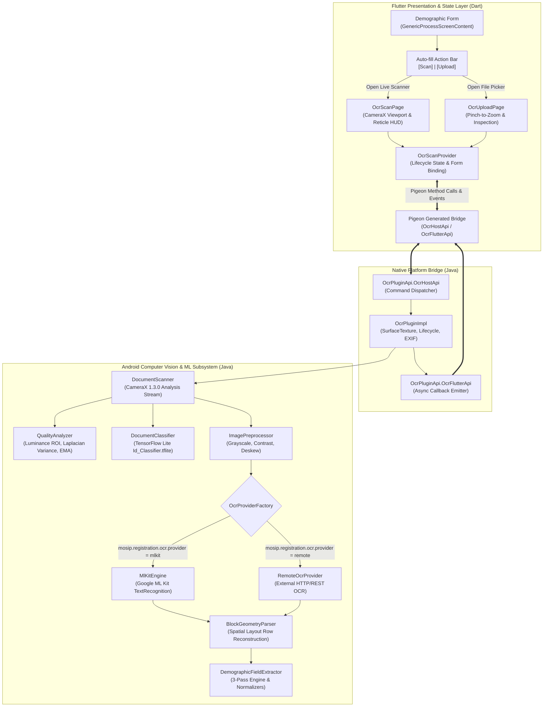
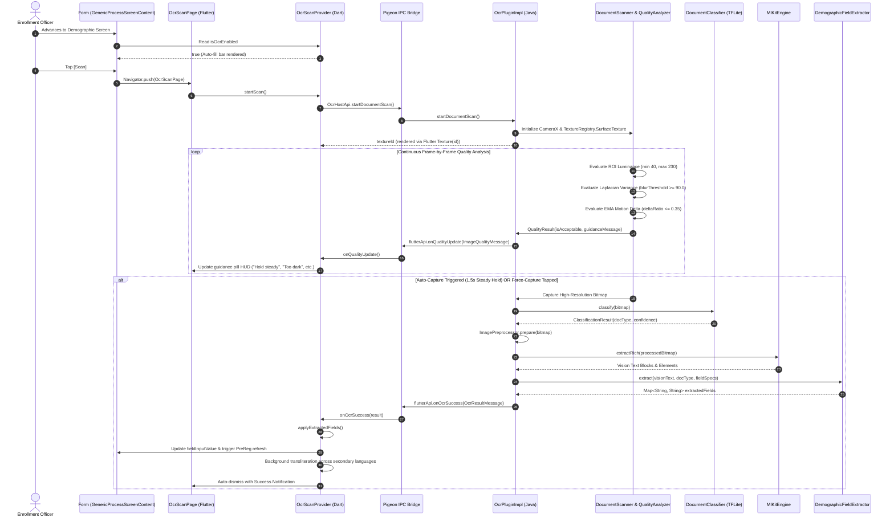
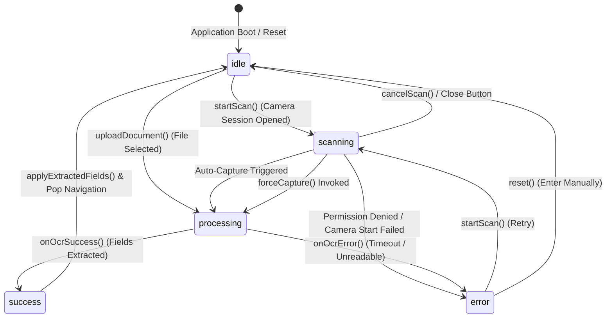
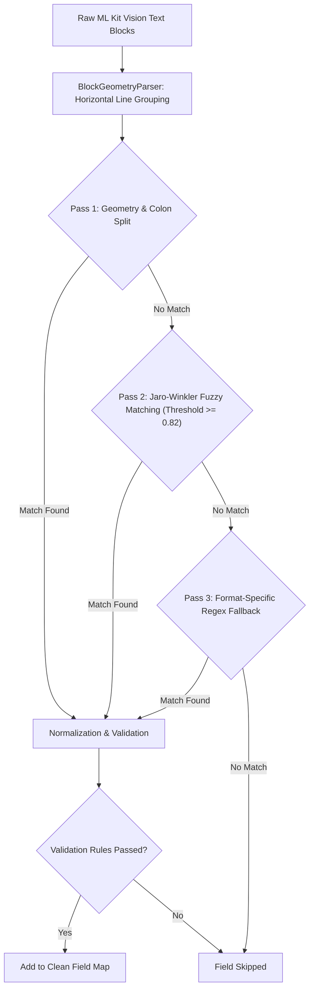

# MOSIP Android Registration Client (ARC) — OCR Integration Developer Guide

**Target Audience**: Core Engineers, Module Leads, System Integrators, QA Automation Engineers  
**Applies To**: MOSIP Android Registration Client (Release 1.2.0 and later)  
**Classification**: Engineering Specification & Implementation Manual  

---

## Table of Contents
1. [Architectural Overview & Engineering Design](#1-architectural-overview--engineering-design)
   - [1.1 Subsystem Architecture](#11-subsystem-architecture)
   - [1.2 Sequence & Communication Lifecycle](#12-sequence--communication-lifecycle)
   - [1.3 Flutter State Machine (OcrScanProvider)](#13-flutter-state-machine-ocrscanprovider)
2. [Local Development Environment Setup](#2-local-development-environment-setup)
   - [2.1 Workstation Prerequisites](#21-workstation-prerequisites)
   - [2.2 Project Setup & Flutter/Gradle Sync](#22-project-setup--fluttergradle-sync)
   - [2.3 Code Generation (Pigeon IPC & Localization)](#23-code-generation-pigeon-ipc--localization)
3. [Core Implementation Deep Dive](#3-core-implementation-deep-dive)
   - [3.1 CameraX Lifecycle & SurfaceTexture Streaming](#31-camerax-lifecycle--surfacetexture-streaming)
   - [3.2 Real-Time Edge Quality Analyzer](#32-real-time-edge-quality-analyzer)
   - [3.3 TensorFlow Lite Document Classifier](#33-tensorflow-lite-document-classifier)
   - [3.4 Spatial Geometry & 3-Pass Field Extraction](#34-spatial-geometry--3-pass-field-extraction)
   - [3.5 Schema Binding via `ocrKey` & Transliteration](#35-schema-binding-via-ocrkey--transliteration)
4. [Configuration & Global Parameters Catalog](#4-configuration--global-parameters-catalog)
   - [4.1 Server-Override & Merge Hierarchy](#41-server-override--merge-hierarchy)
   - [4.2 Parameters Catalog](#42-parameters-catalog)
5. [Testing, Code Quality & APK Packaging](#5-testing-code-quality--apk-packaging)
   - [5.1 Unit Tests & Coverage](#51-unit-tests--coverage)
   - [5.2 Flutter Static Analysis](#52-flutter-static-analysis)
   - [5.3 Building Release APKs](#53-building-release-apks)
6. [Audit Trails & Event Specifications](#6-audit-trails--event-specifications)

---

## 1. Architectural Overview & Engineering Design

The OCR Auto-Fill module bridges high-performance native Android computer vision algorithms with Flutter's reactive UI framework via **Pigeon** type-safe IPC channels.

### 1.1 Subsystem Architecture



---

### 1.2 Sequence & Communication Lifecycle



---

### 1.3 Flutter State Machine (`OcrScanProvider`)

The scanning lifecycle is governed by an explicit finite state machine:



---

## 2. Local Development Environment Setup

### 2.1 Workstation Prerequisites
Ensure your development environment meets the following specifications:
- **Operating System**: Windows 10/11, macOS (Apple Silicon or Intel), or Linux (Ubuntu 20.04+).
- **Flutter SDK**: `3.10.4` (Channel stable, managed via [FVM](https://fvm.app/) recommended).
- **Java Development Kit (JDK)**: OpenJDK 11 or 17.
- **Android SDK**: Build-Tools `33.0.1`+, Platform SDK `android-33` or `android-34`.
- **Android NDK**: Version configured in `android/app/build.gradle` (`ndkVersion flutter.ndkVersion`).
- **Android Studio**: Flamingo / Giraffe / Hedgehog with Flutter and Dart plugins installed.

---

### 2.2 Project Setup & Flutter/Gradle Sync

1. **Clone the Repository**:
   ```bash
   git clone -b feature/ocr-integration https://github.com/Jay1q2w/android-registration-client.git
   cd android-registration-client
   ```

2. **Install Flutter Dependencies**:
   ```bash
   # Using FVM (recommended):
   fvm use 3.10.4
   fvm flutter pub get

   # Or using standard Flutter:
   flutter pub get
   ```

3. **Configure Local Android Properties**:
   Create or verify `android/local.properties`:
   ```properties
   sdk.dir=C:\\Users\\<username>\\AppData\\Local\\Android\\Sdk
   flutter.sdk=C:\\tools\\flutter
   ```

4. **Verify Gradle Compilation**:
   ```bash
   cd android
   ./gradlew clean assembleDebug
   cd ..
   ```

---

### 2.3 Code Generation (Pigeon IPC & Localization)

When modifying Pigeon definitions or localization strings, regenerate the bridges:

#### 1. Generate Pigeon IPC Code
The Pigeon definition resides in [`pigeon/ocr_messages.dart`]. To generate the corresponding Dart contract ([`lib/core/bridge/ocr_api.g.dart`]) and Java interface ([`android/app/src/main/java/io/mosip/registration_client/ocr/OcrPluginApi.java`]):

```bash
flutter pub run pigeon \
  --input pigeon/ocr_messages.dart \
  --dart_out lib/core/bridge/ocr_api.g.dart \
  --java_out android/app/src/main/java/io/mosip/registration_client/ocr/OcrPluginApi.java \
  --java_package "io.mosip.registration_client.ocr"
```

#### 2. Generate Localization Bundles
```bash
flutter gen-l10n
```

---

## 3. Core Implementation Deep Dive

### 3.1 CameraX Lifecycle & SurfaceTexture Streaming
- **Native Implementation**: [`DocumentScanner.java`] and [`OcrPluginImpl.java`].
- **Mechanism**: Rather than creating an embedded Android view (which introduces heavy compositing overhead), the engine requests an uncompressed OpenGL `SurfaceTexture` from Flutter's `TextureRegistry`:
  ```java
  textureEntry = textureRegistry.createSurfaceTexture();
  SurfaceTexture surfaceTexture = textureEntry.surfaceTexture();
  ```
- **Lifecycle Guarantees**:
  - Automatically unbinds CameraX use cases (`cameraProvider.unbindAll()`) on cancellation, screen pop, or lifecycle stop.
  - Surface textures are explicitly unlinked and recycled (`textureEntry.release()`) to prevent GPU memory leaks.
  - Thread-safe generation counters (`AtomicInteger scanGeneration`) guarantee that late-arriving frames from cancelled sessions are discarded.

---

### 3.2 Real-Time Edge Quality Analyzer
Implemented in [`QualityAnalyzer.java`]. Evaluates every raw Y-plane luminance buffer in real time:

1. **Luminance Evaluation**:
   - Samples grayscale pixel intensities within the center Region of Interest (ROI: 15% to 85% width, 17.5% to 82.5% height).
   - Enforces an acceptable average brightness range between 40.0 and 230.0 (triggers "Too dark" or "Too bright" alerts when outside this range).
2. **Sharpness Evaluation (Laplacian Variance)**:
   - Applies a 4-neighbor discrete Laplacian filter across the center ROI to calculate edge gradients.
   - Computes statistical variance across the edge values to measure focus clarity.
   - Enforces a minimum sharpness variance threshold (default: 90.0) to filter out out-of-focus or blurry frames ("Hold steady — image is blurry").
3. **Motion Stability (Exponential Moving Average)**:
   - Tracks frame-to-frame sharpness stability using an Exponential Moving Average (EMA with alpha = 0.3).
   - Computes the relative variance fluctuation between consecutive frames. If frame fluctuation exceeds 35%, the frame is flagged as unstable (`"Hold steady — camera is moving"`), preventing blurred captures while the tablet is in motion.

---

### 3.3 TensorFlow Lite Document Classifier
Implemented in [`DocumentClassifier.java`].
- **Execution**: Runs on the raw RGB color bitmap before grayscale preprocessing.
- **Dynamic Tensor Inspection**: Automatically inspects model input dimensions at runtime (e.g., `[1, 640, 640, 3]`) and scales bilinear resizing operations accordingly.
- **Confidence Cutoff**: Predictions with probability below 0.60 (60%) output `UNKNOWN` without raising an exception, safely falling back to universal regex and fuzzy extraction.

---

### 3.4 Spatial Geometry & 3-Pass Field Extraction
Implemented in [`DemographicFieldExtractor.java`] and [`BlockGeometryParser.java`].



1. **Pass 1 (Geometric Row Splitting)**:
   Reconstructs text fragments that share vertical overlap into unified `LayoutRow` structures, splitting labels and values across standard delimiters (`:`, `-`, `/`, `|`).
2. **Pass 2 (Fuzzy Next-Line Evaluation)**:
   Uses Jaro-Winkler string similarity (threshold >= 0.82) to detect field labels even when OCR introduces minor character errors (e.g., `D0B` -> `DOB`), searching adjacent downward rows.
3. **Pass 3 (Regex Fallback)**:
   Applies strict patterns for structured tokens (`dateofbirth`, `phone`, `postalcode`, `documentnumber`).
4. **Field Validation**:
   - Name fields must contain alphabetical characters and **zero** digits.
   - Date fields must contain valid day/month/year components.
   - Irrelevant fields are suppressed based on document classification (e.g. suppressing address fields for PAN card).

---

### 3.5 Schema Binding via `ocrKey` & Transliteration
Implemented in [`lib/provider/ocr_scan_provider.dart`].

1. **Dynamic Schema Binding**:
   Matches extracted keys against the UI Spec:
   - Resolves `field.id` or `field.ocrKey`.
   - Date formats are converted according to `field.format` (default: `yyyy/MM/dd`).
   - Gender values map to MOSIP standardized codes (`MLE`, `FEM`, `OTH`).
2. **Multilingual Transliteration Dispatch**:
   When updating `simpleType` fields (multilingual name/address fields), the provider writes directly to `globalProvider.fieldInputValue` and kicks off background transliteration:
   ```dart
   TransliterationServiceImpl().transliterate(
     TransliterationOptions(
       input: value,
       sourceLanguage: "Any",
       targetLanguage: transliterationLangMapper[targetCode] ?? targetCode,
     ),
   );
   ```

---

## 4. Configuration & Global Parameters Catalog

All parameters are **server-driven** via MOSIP's `GlobalParamRepository` (synced to the local SQLite database from the MOSIP server configuration service). They are **not hardcoded constants**—the built-in values serve as **robust offline/default fallbacks** when no server override is defined or prior to initial configuration sync.

### 4.1 Server-Override & Merge Hierarchy
Implemented in [`ExtractionConfig.java`] and [`OcrConfig.java`]:
1. **Dynamic Server Override**: At runtime, the client reads the parameter from the synced SQLite cache (`globalParamRepository.getCachedStringGlobalParam(key)`).
2. **Built-in Fallback**: If the server parameter is empty, null, or invalid JSON, the client falls back to the safe built-in default without raising an error.
3. **Smart Map Merge**: For dictionary parameters (`extraction.labels` and `field_regexes`), server-configured entries **override matching keys and merge on top of built-in defaults**. This allows adopting countries to define only country-specific overrides without re-specifying every universal field.
4. **Clean Set/Scalar Override**: For set and scalar parameters (`gender_values`, `month_names`, `header_patterns`, `fuzzy_threshold`, `noise_chars`), the server-supplied array or scalar replaces the default set in its entirety.

### 4.2 Parameters Catalog

| Parameter Key | Data Type | Server-Driven Behavior & Built-in Fallback | Description |
|---|---|---|---|
| `mosip.registration.ocr.enabled` | Boolean | **Server Toggle**<br/>*(Default: `false`)* | Master toggle to enable/disable OCR in ARC. Evaluated dynamically. |
| `mosip.registration.ocr.provider` | String | **Server Override**<br/>*(Default: `mlkit`)* | Active OCR engine. Accepts `mlkit` (on-device) or `remote` (HTTP REST endpoint). |
| `mosip.registration.ocr.response.timeout` | Integer | **Server Override**<br/>*(Default: `10000` ms)* | Overall OCR processing timeout in milliseconds before raising `TIMEOUT`. |
| `mosip.registration.ocr.service.url` | String | **Server Required if Remote**<br/>*(Default: `null`)* | Target endpoint URL for external OCR engine (required when `provider = remote`). |
| `mosip.registration.ocr.quality.max_retries` | Integer | **Server Override**<br/>*(Default: `30`)* | Maximum sub-optimal frames before prompting operator with manual force-capture. |
| `mosip.registration.ocr.quality.thresholds.brightness_min` | Float | **Server Override**<br/>*(Default: `40.0`)* | Minimum acceptable center-ROI luminance (0–255). Triggers "Too dark". |
| `mosip.registration.ocr.quality.thresholds.brightness_max` | Float | **Server Override**<br/>*(Default: `230.0`)* | Maximum acceptable center-ROI luminance (0–255). Triggers "Too bright". |
| `mosip.registration.ocr.quality.thresholds.blur_variance` | Double | **Server Override**<br/>*(Default: `90.0`)* | Minimum Laplacian filter variance for sharpness. Triggers "image is blurry". |
| `mosip.registration.ocr.ui.spec` | JSON String | **Server Override**<br/>*(Default: `null`)* | Optional JSON array overriding demographic fields to extract. If null, uses UI Schema. |
| `mosip.registration.ocr.extraction.labels` | JSON String | **Server Merged**<br/>*(Default: Built-in English/common synonyms)* | Map associating label variations with canonical field names. Server entries override matching keys and merge over defaults. |
| `mosip.registration.ocr.extraction.gender_values` | JSON String | **Server Override**<br/>*(Default: `["male", "female", "m", "f", "transgender", "other", "others"]`)* | Set of valid gender keyword strings. Server list cleanly overrides default set when defined. |
| `mosip.registration.ocr.extraction.month_names` | JSON String | **Server Override**<br/>*(Default: 12 English months + short forms)* | Month names used for converting textual dates (e.g. `12-Oct-1990`). Server overrides for localized languages. |
| `mosip.registration.ocr.extraction.header_patterns` | JSON String | **Server Override**<br/>*(Default: `["government of", "republic of", "dept of", ...]`)* | Substrings of national seals, ministry headers, or coat-of-arms to discard during extraction. |
| `mosip.registration.ocr.extraction.noise_chars` | String | **Server Override**<br/>*(Default: `"\|\`")* | Noise punctuation characters to strip from OCR text tokens. |
| `mosip.registration.ocr.extraction.fuzzy_threshold` | Float | **Server Override**<br/>*(Default: `0.82`)* | Jaro-Winkler string similarity threshold (0.0 to 1.0) for fuzzy label matching. |
| `mosip.registration.ocr.extraction.field_regexes` | JSON String | **Server Merged**<br/>*(Default: Built-in regexes for `dob`, `phone`, `email`, `postalcode`, `documentnumber`)* | Regex patterns for structured fields. Server entries merge over and extend built-in defaults. |


---

## 5. Testing, Code Quality & APK Packaging

### 5.1 Unit Tests & Coverage
Run native unit tests and generate the Jacoco code coverage report:

```bash
cd android
./gradlew testDebugUnitTest jacocoTestReport
```

View the generated coverage report at:
`android/app/build/reports/jacoco/jacocoTestReport/html/index.html`

### 5.2 Flutter Static Analysis
```bash
flutter analyze
```

### 5.3 Building Release APKs
Execute standard packaging commands:

```bash
# Debug APK
flutter build apk --debug

# Production Release APK (Signed via local.properties keystore config)
flutter build apk --release
```

---

## 6. Audit Trails & Event Specifications

Every OCR lifecycle transition produces a non-repudiable audit event in the client database:

| Audit Event Code | Event Type | Description | Logged Metadata |
|---|---|---|---|
| `REG-EVT-115` | `USER_EVENT` | Live camera scanning initiated | Operator ID, timestamp |
| `REG-EVT-116` | `USER_EVENT` | Document image upload initiated | Operator ID, timestamp |
| `REG-EVT-117` | `USER_EVENT` | OCR extraction completed successfully | Document type, fields extracted count, confidence % |
| `REG-EVT-118` | `USER_EVENT` | Fields auto-filled into registration form | Document type, applied fields count |
| `REG-EVT-050` | `USER_EVENT` | Document scan failed or aborted | Error code, diagnostic error message |
