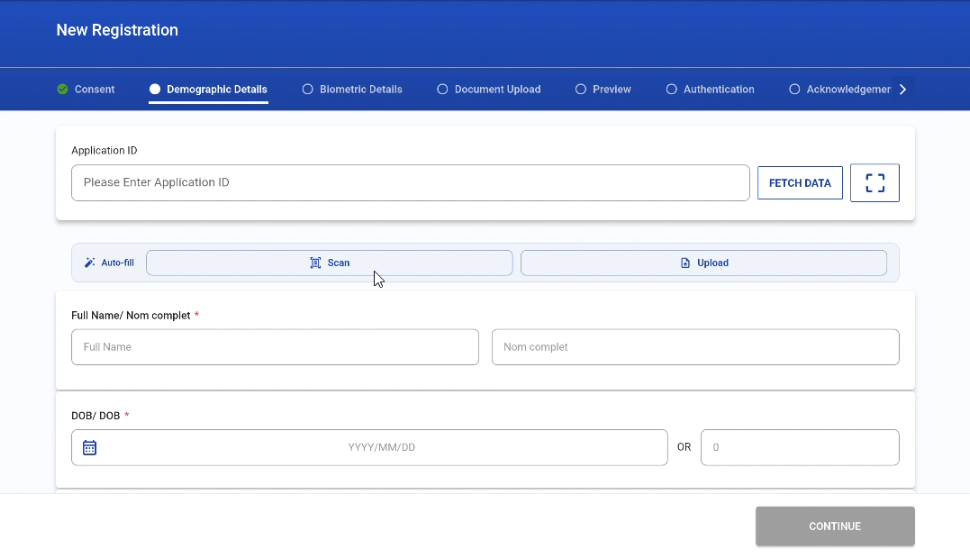
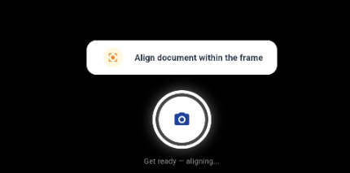
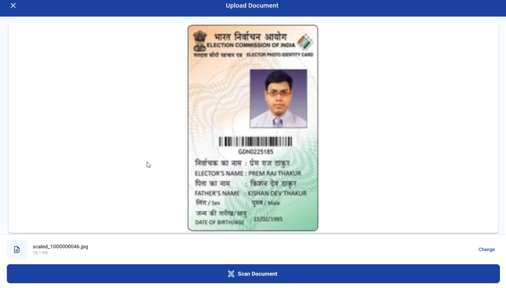
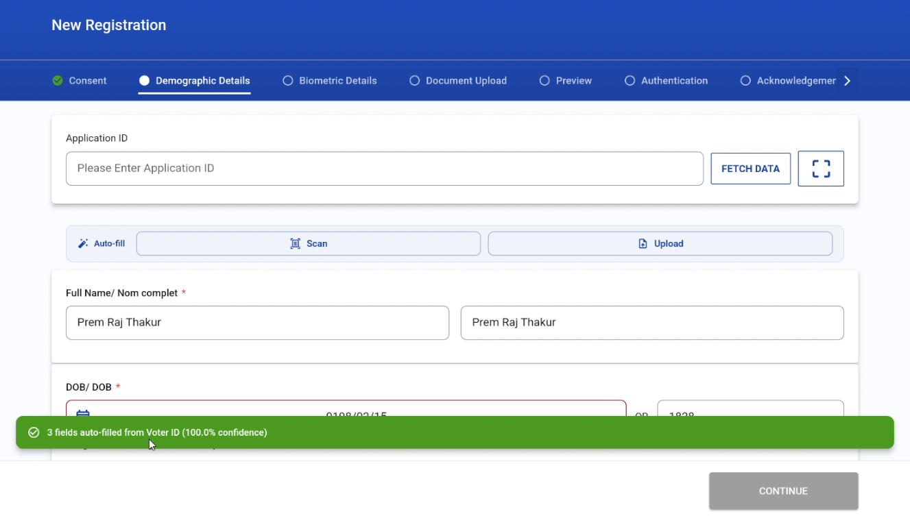

# MOSIP Android Registration Client (ARC) - OCR Document Auto-Fill Operator & User Guide

**Target Audience**: Registration Officers, Enrollment Station Operators, Field Supervisors, Training Coordinators  
**Applies To**: MOSIP Android Registration Client v1.2.0 and later  
**Classification**: Public / Operational Standard Operating Procedure (SOP)  

---

## Table of Contents
1. [Executive Summary & Purpose](#1-executive-summary--purpose)
2. [Operational Prerequisites & Environment Setup](#2-operational-prerequisites--environment-setup)
3. [End-to-End Operational Workflow](#3-end-to-end-operational-workflow)
4. [Standard Operating Procedure (SOP) 1: Live Camera Document Scan](#4-standard-operating-procedure-sop-1-live-camera-document-scan)
   - [4.1 Initializing the Scanner](#41-initializing-the-scanner)
   - [4.2 Framing and Initial Alignment Phase](#42-framing-and-initial-alignment-phase)
   - [4.3 Real-Time Image Quality Guidance](#43-real-time-image-quality-guidance)
   - [4.4 Automatic Capture vs. Operator Force-Capture](#44-automatic-capture-vs-operator-force-capture)
5. [Standard Operating Procedure (SOP) 2: Document Image Upload](#5-standard-operating-procedure-sop-2-document-image-upload)
   - [5.1 When to Utilize File Upload](#51-when-to-utilize-file-upload)
   - [5.2 Selecting and Inspecting Image Assets](#52-selecting-and-inspecting-image-assets)
   - [5.3 Triggering Extraction](#53-triggering-extraction)
6. [Data Extraction Verification & Form Harmonization](#6-data-extraction-verification--form-harmonization)
   - [6.1 Document Classification & Confidence Scoring](#61-document-classification--confidence-scoring)
   - [6.2 Field Mapping & Validation Rules](#62-field-mapping--validation-rules)
   - [6.3 Multilingual Transliteration Workflow](#63-multilingual-transliteration-workflow)
7. [Security, Privacy & Data Protection Protocols](#7-security-privacy--data-protection-protocols)
8. [Troubleshooting & Exception Handling Matrix](#8-troubleshooting--exception-handling-matrix)

---

## 1. Executive Summary & Purpose

The **Optical Character Recognition (OCR) Document Auto-Fill** module in the MOSIP Android Registration Client (ARC) facilitates rapid, error-free capture of applicant demographic information from official government-issued identity documents. 

By executing lightweight, on-device Machine Learning models (TensorFlow Lite) and localized computer vision text recognizers directly on the enrollment tablet, the system automatically detects document types, reads demographic text, normalizes data formats, and populates registration forms in real time.

### Key Operational Objectives:
- **Throughput Optimization**: Reduces average demographic data capture time from 5-8 minutes down to under 15 seconds per applicant.
- **Data Integrity**: Drastically minimizes clerical errors, typographical mistakes, and transposition errors in critical fields such as National ID numbers, dates of birth, and surnames.
- **100% Offline Resilience**: Executes entirely on-device without requiring network connectivity, ensuring uninterrupted field operations in rural or disconnected enrollment centers.

---

## 2. Operational Prerequisites & Environment Setup

### 2.1 Hardware Requirements
- **Tablet / Device**: Android tablet running Android 9.0 (API Level 28) or higher.
- **Integrated Camera**: Minimum 8.0 Megapixels with continuous autofocus hardware capability.
- **Device Memory**: Minimum 3 GB RAM (4 GB+ recommended for seamless multi-language transliteration and camera streaming).

### 2.2 Physical Environment & Lighting Guidelines
- **Worksurface**: Place documents on a flat, non-reflective surface providing high visual contrast relative to the document edges (e.g., a dark, matte desk mat for light-colored cards).
- **Illumination**: Maintain uniform, diffuse lighting between 300 to 500 Lux. Avoid placing the registration desk directly beneath unshielded spotlight fixtures or near bright windows that cause high specular glare on laminated cards.
- **Document Cleanliness**: Ensure identity cards and passport pages are free from physical obstructions, heavy fingerprints, or external plastic sleeves that degrade camera contrast.

---

## 3. End-to-End Operational Workflow

The following flowchart outlines the complete operational lifecycle from initial applicant document intake through to final demographic verification:

```mermaid
flowchart TD

    A["Applicant Presents Physical Identity Document"] --> B["Operator Opens Demographic Registration Step"]
    B --> C{"Select Auto-Fill Input Method"}

    C -->|Real-Time Camera Capture| D["Tap Scan Button"]
    C -->|Pre-Captured Image / External Scanner| E["Tap Upload Button"]

    subgraph LiveScanWorkflow["Live Camera Scanning (CameraX)"]
        D --> F["Position Document within Frame Reticle"]
        F --> G["4-Second Stabilization and Auto-Focus Period"]
        G --> H{"Quality Analyzer Evaluation"}

        H -->|Sub-optimal Lighting / Blur / Motion| I["Real-Time Operator Guidance Displays"]
        I --> F

        H -->|Acceptable Quality Frame Detected| J["Green Countdown Progress Ring (1.5s)"]
        J --> K["Automated High-Resolution Capture"]

        H -->|Retry Limit Reached| L["Operator Manual Force-Capture Trigger"]
        L --> K
    end

    subgraph UploadWorkflow["Image File Upload Workflow"]
        E --> M["Select Image from Gallery (JPG, PNG, WebP)"]
        M --> N["Pinch-to-Zoom Quality and Completeness Inspection"]
        N --> O["Tap Scan Document Button"]
    end

    K --> P["On-Device Pipeline: Classification + OCR + Extraction"]
    O --> P

    subgraph ExtractionProcessing["Processing and Harmonization"]
        P --> Q["TFLite Document Classification (Confidence Score)"]
        Q --> R["Spatial Geometry Block Extraction and Parsing"]
        R --> S["Data Normalization (Dates, Names, Gender)"]
        S --> T["Multilingual Transliteration Synchronization"]
    end

    T --> U["Auto-Fill Demographic Form Controls"]
    U --> V["Operator Verifies Data Against Physical Document"]

    V --> W{"Data Discrepancy Found?"}

    W -->|Yes| X["Operator Manually Edits Form Field"]
    W -->|No| Y["Proceed to Biometrics Capture"]

    X --> Y
   ```

---

## 4. Standard Operating Procedure (SOP) 1: Live Camera Document Scan

### 4.1 Initializing the Scanner
1. Advance applicant enrollment to the **Demographic Details** screen.
2. In the top action banner, tap the **Scan** button (indicated by the document scanner icon).
3. *First-Time Launch*: When prompted by the Android operating system, grant camera permission by selecting **While using the app**. 
   *(Note: If permission was previously denied, tap **Open Settings** on the dialog to enable camera access manually).*



---

### 4.2 Framing and Initial Alignment Phase
1. Hold the tablet parallel to the document at a working distance of approximately 20 to 30 centimeters (8 to 12 inches).
2. Align the document so that all four physical borders fit cleanly within the on-screen corner brackets (reticle).
3. **Stabilization Phase**: For the first 4 seconds, the system activates autofocus routines and baseline lighting calibration. The top guidance pill will read:

   


---

### 4.3 Real-Time Image Quality Guidance
The ARC scanner utilizes an integrated edge computing quality analyzer that inspects every incoming frame for luminance, blur, and motion stability before permitting capture.

Observe the floating guidance pill centered at the bottom of the viewport:

| Guidance Message | Visual Status | Root Cause | Operator Action Required |
|---|---|---|---|
| **`Align document within the frame`** | Amber Pill | Card is partially out of bounds or angled excessively. | Re-center the document so all four corners are visible inside the reticle. |
| **`Too dark — move to better lighting`** | Amber Pill | Average frame brightness is below the minimum threshold (<= 40 Lux). | Move the card into uniform light or reposition auxiliary desk lighting. |
| **`Too bright — reduce glare`** | Amber Pill | Harsh reflections detected on card laminate (>= 230 Lux). | Tilt the document slightly (5° to 10°) to deflect specular glare away from the lens. |
| **`Hold steady — image is blurry`** | Amber Pill | Laplacian sharpness variance is below threshold (<= 90.0). | Ensure lens is clean. Keep hands still to allow camera autofocus to lock. |
| **`Hold steady — camera is moving`** | Amber Pill | Frame-to-frame motion delta exceeds stability tolerance (> 35%). | Rest elbows on desk surface to stabilize the tablet. |
| **`Hold steady — capturing...`** | Green Pill | Frame meets all sharpness, lighting, and stability criteria. | Maintain current position without moving while the capture initiates. |

---

### 4.4 Automatic Capture vs. Operator Force-Capture
- **Automated Capture (Recommended)**: As soon as the document achieves optimal quality, a dynamic green circular countdown ring animates around the central shutter button. Maintain your position for 1.5 seconds; the system will snap the image automatically without requiring a button press.
- **Manual Force-Capture (Challenging Environments)**: If a physical card is severely worn, scratched, or operating under unavoidable lighting constraints, the automated gate may hesitate. 
  - After 8 failed frame evaluations, the guidance message updates to:
    > `Quality retry limit reached — capture anyway or cancel`
  - The operator may tap the white **Circular Shutter Button** at any point to force an immediate capture, bypassing the quality analyzer.

---

## 5. Standard Operating Procedure (SOP) 2: Document Image Upload

### 5.1 When to Utilize File Upload
The file upload mechanism is recommended when:
- Operating in fixed enrollment centers equipped with flatbed or dedicated document feed scanners connected to the workstation network.
- Processing pre-existing, certified digital copies of applicant identity documentation.
- Accommodating applicants whose physical documents are bound in reflective protective materials that preclude live tablet camera scanning.

---

### 5.2 Selecting and Inspecting Image Assets
1. On the Demographic Details screen, tap the **Upload** button in the Auto-fill action bar.
2. The native Android storage picker opens. Locate and select the document image.
   - **Supported File Formats**: `JPEG` / `JPG`, `PNG`, `WebP`, `BMP`.
   - **Maximum File Size**: 15 MB.
3. The application loads the selected image into an interactive high-resolution viewport.
4. **Inspection Guidelines**:
   - Utilize two-finger **pinch-to-zoom** and **pan** gestures across the document image.
   - Verify that all textual entries are crisp and clearly legible.
   - Verify that all four corners and official seals are visible.
   - If the image is blurry, cropped, or incorrect, tap **Change** to select an alternate image file.


---

### 5.3 Triggering Extraction
1. Once visual inspection is satisfactory, tap the primary **Scan Document** button at the bottom of the display.
2. The application transitions to a modal processing indicator displaying:
   > `Reading Document... Extracting demographic details`
3. Extraction executes locally on-device and typically concludes within 1.5 to 3.0 seconds.

---

## 6. Data Extraction Verification & Form Harmonization

### 6.1 Document Classification & Confidence Scoring
Upon successful extraction, the scanner automatically closes and presents an operational confirmation snackbar:

> `✓ [X] fields auto-filled from [Document Type] ([Confidence Score]% confidence)`


- **Confidence Threshold**: The classification model operates on a 0.60 (60%) threshold. Recognitions with confidence scores above 60% apply specialized document rules (such as suppressing irrelevant address fields when processing tax cards).
- **Unrecognized Document Formats**: If a document is classified as `UNKNOWN`, the system automatically falls back to universal fuzzy text extraction without aborting the session.


---

### 6.2 Field Mapping & Validation Rules
Registration officers must review the auto-populated demographic fields against the physical document according to the following standards:

| Form Field | Extraction & Normalization Behavior | Operator Review Standard |
|---|---|---|
| **Full Name / Given Name** | Automatic capitalization (Title Case). Excess honorifics or leading/trailing noise symbols (`\|`, `:`, `-`) are stripped. | Check spelling against physical card. Verify family name is correctly ordered. |
| **Date of Birth (DOB)** | Harmonized into standard ISO format (`YYYY/MM/DD`). The integrated age calculation widget synchronizes automatically. | Verify day and month ordering (e.g. confirming `04/05` is April 5th vs May 4th). |
| **Gender** | Text variations (`Male`, `M`, `Homme`, `Female`, `F`, `Femme`) normalize to standardized MOSIP codes (`MLE`, `FEM`, `OTH`). | Verify radio button or dropdown selection matches physical document. |
| **Address Lines** | Multi-line spatial block reconstruction reassembles contiguous address elements into single lines. | Confirm house numbers, street names, and sub-districts are complete. |
| **Postal Code / PIN** | Clean numeric extraction. Suppressed automatically if document type does not support postal codes. | Verify 5 or 6 digit postal sequence. |
| **Document Number** | Strict alphanumeric regex validation removes erroneous spaces or delimiter characters. | Confirm exact match with the document's printed serial/national ID number. |

---

### 6.3 Multilingual Transliteration Workflow
For jurisdictions operating with multiple official languages (e.g. English, French, Arabic, Hindi, Swahili):
1. The OCR system extracts text in the primary document language.
2. The application populates all active language tabs in the form simultaneously.
3. An asynchronous background service invokes the **MOSIP Transliteration Engine**, mapping names from the source script into each target regional script.
4. **Operator Verification**: Switch between language tabs on the demographic screen. If a phonetic transliteration deviates from the applicant's preferred spelling, tap the field and edit it using the on-screen localized keyboard.

---

## 7. Security, Privacy & Data Protection Protocols

To ensure strict compliance with international identity standards and national data protection legislation:

1. **Zero Permanent Image Retention**:
   - The ARC application does **not** store captured identity card photos in the local Android gallery or permanent storage.
   - Images are decoded directly into transient RAM memory for OCR execution.
2. **Deterministic Cache Cleanup**:
   - Any temporary cached file generated during live camera frame processing or gallery selection is deleted immediately via explicit unlinking (`File.delete()`) upon:
     - Successful data extraction and auto-fill.
     - Encountering a processing failure or error.
     - Manual operator cancellation via the Close (`X`) button.
3. **Cryptographic Audit Logging**:
   - Every stage of the OCR interaction generates a signed, non-repudiable audit event in the local MOSIP database:
     - `REG-EVT-115`: OCR scan session initiated via camera.
     - `REG-EVT-116`: OCR image upload initiated via file picker.
     - `REG-EVT-117`: Successful OCR extraction (records document type, field count, and confidence score).
     - `REG-EVT-118`: Extracted fields successfully applied into registration form.
     - `REG-EVT-050`: Document scan aborted, timed out, or encountered hardware failure.

---

## 8. Troubleshooting & Exception Handling Matrix

When unexpected conditions arise, consult the following diagnostic matrix:

| Error Symptom / Message | Probable Root Cause | Recommended Corrective Action |
|---|---|---|
| **"Camera Permission Required" Alert** | Camera permission was denied or restricted by device administrator profile. | 1. Tap **Open Settings** on the prompt.<br/>2. Select **Permissions** -> **Camera**.<br/>3. Set to **Allow only while using the app**.<br/>4. Return to MOSIP ARC. |
| **"No document detected. Please position your document within the frame" (Code 101)** | Card borders are outside the reticle, or surface contrast is insufficient. | 1. Place the card against a dark, contrasting background.<br/>2. Ensure all four corners are visible.<br/>3. Re-orient document to eliminate severe angles. |
| **"Image quality is too low. Improve lighting and hold steady" (Code 106)** | Camera lens is smudged, lighting is too low, or tablet was shaken during capture. | 1. Clean the tablet camera lens with a microfiber cloth.<br/>2. Increase desk lighting.<br/>3. Rest tablet on a stable stand or desk. |
| **"Could not extract fields from this document"** | Document is upside down, severely faded, laminated with heavy scratches, or unsupported. | 1. Check document orientation.<br/>2. If text is severely worn, tap **Enter Manually** on the error dialog to type the details. |
| **"Could not read this image file" (Image Decode Failed)** | Uploaded file is corrupt or saved in an unsupported format (e.g. HEIC, PDF). | 1. Ensure file is standard `JPG` or `PNG`.<br/>2. Re-export or re-capture the image using standard device settings. |
| **"OCR processing timed out"** | Device CPU throttling under high thermal load or background tasks. | 1. Tap **Try Again**.<br/>2. If problem persists, close unnecessary background apps and retry. |
| **Transliteration spelling discrepancy** | Phonetic ambiguity during automated name translation. | Select the secondary language tab on the form and manually correct the spelling using the localized virtual keyboard. |

---

